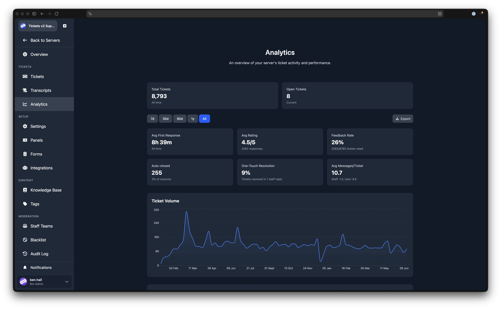
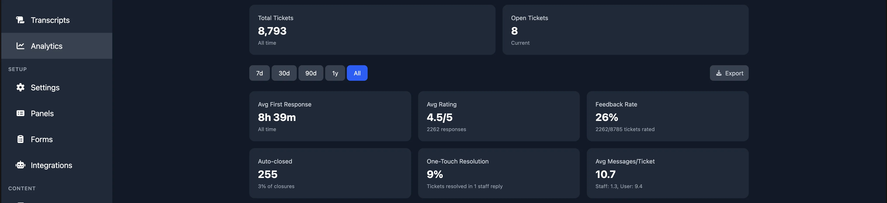
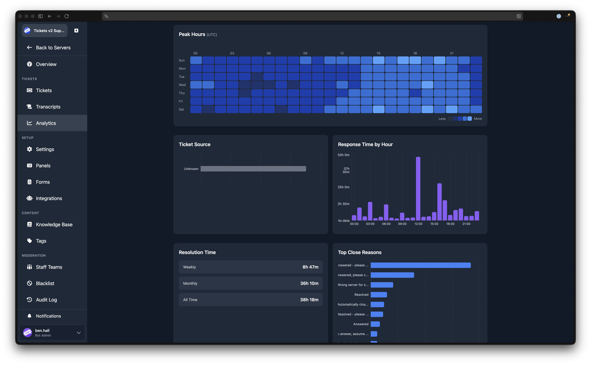
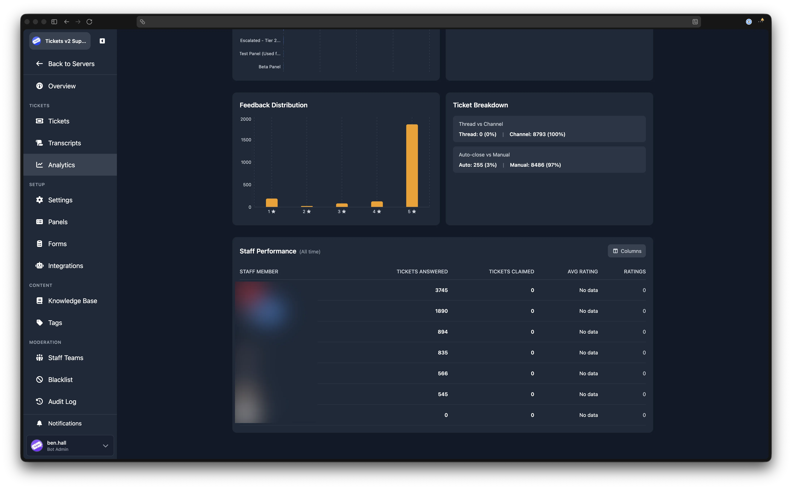

# Analytics

::: tip Premium Feature
Analytics is available to servers with a [Premium](../premium/introduction) subscription. Servers without Premium see a preview of the available metrics with a link to upgrade.
:::

The Analytics page gives you detailed insight into your server's ticket activity, staff performance, and user feedback over time. You can adjust the time range, explore charts and breakdowns, and export data for offline analysis.

## Time Range

A row of buttons at the top lets you filter most of the page by time range. The available options are **7d**, **30d**, **90d**, **1y**, and **All**. The default is 30d. The two all-time stat cards (Total Tickets and Open Tickets) are not affected by this selector.

## Stat Cards

### All-Time Stats

Two cards are always visible, regardless of the time range:

| Card | Description |
|------|-------------|
| **Total Tickets** | The total number of tickets ever created. |
| **Open Tickets** | The number of tickets currently open. |

### Time-Filtered Stats

Six additional cards update when you change the time range:

| Card | Description |
|------|-------------|
| **Avg First Response** | The average time until a staff member first replies. |
| **Avg Rating** | The average star rating from user feedback (out of 5). Shows the number of responses underneath. |
| **Feedback Rate** | The percentage of closed tickets that received a rating, shown as rated tickets out of total closed tickets. |
| **Auto-closed** | The number of tickets closed automatically, with the percentage of total closures. |
| **One-Touch Resolution** | The percentage of tickets resolved with a single staff reply. |
| **Avg Messages/Ticket** | The average total messages per ticket, with a staff and user breakdown underneath. |

## Charts

### Ticket Volume

An area chart showing the number of tickets created per day over the selected time range. Hover over any point to see the exact date and count.

### Backlog Trend

An area chart showing the number of open tickets at the end of each day. This helps you spot whether your queue is growing or shrinking over time.

### Peak Hours

A heatmap displaying ticket creation volume by day of the week and hour of the day. All times are shown in UTC. Darker cells indicate higher volume. Hover over a cell to see the exact day, hour, and ticket count.

### Ticket Source

A horizontal bar chart showing how tickets were created. The possible sources are:

| Source | Meaning |
|--------|---------|
| **Panel** | The user clicked a button on a [ticket panel](./ticket-panels). |
| **Command** | The user ran the `/open` or `/new` command. |
| **Unknown** | The creation method was not recorded. |

### Response Time by Hour

A bar chart showing the average first response time broken down by hour of the day (UTC). This helps you identify when your team responds fastest and when gaps exist.

## Additional Breakdowns

### Resolution Time

Shows the average time from ticket creation to closure, split into three windows: **Weekly**, **Monthly**, and **All Time**.

### Top Close Reasons

A horizontal bar chart of the most common close reasons used when tickets are closed. If no close reasons have been recorded, a message is shown instead.

### Tickets by Panel

A horizontal bar chart showing how many tickets were created from each [panel](./ticket-panels) in the selected time range.

### Tickets by Label

A horizontal bar chart showing the number of tickets assigned to each [label](./tickets#labels). Each bar uses the label's colour.

### Feedback Distribution

A bar chart showing how many ratings were given for each star value (1 through 5). See [User Feedback](./settings/user-feedback) for information on enabling ratings.

### Ticket Breakdown

Two summary rows:

- **Thread vs Channel** shows the split between tickets opened as Discord threads and tickets opened as separate channels.
- **Auto-close vs Manual** shows how many tickets were closed automatically versus manually by a staff member or the user.

## Staff Performance

::: tip Admin Only
The staff performance table is visible only to server administrators.
:::

A table at the bottom of the page lists each staff member who was active during the selected time range. The default columns are:

| Column | Description |
|--------|-------------|
| **Staff Member** | The staff member's Discord username, linked to their [detail page](#staff-detail-page). |
| **Tickets Answered** | The number of tickets where this staff member sent at least one message. |
| **Tickets Claimed** | The number of tickets this staff member claimed. |
| **Avg Rating** | The average rating received on tickets this staff member handled. |

A **Ratings** column always displays alongside the selected columns, showing the total number of feedback responses received.

You can show or hide columns using the column selector button in the top-right corner of the table.

### Staff Detail Page

Clicking a staff member's name opens a detail page with that individual's analytics. This page includes:

- **Stat cards**: Avg Rating, Avg First Response, Tickets Claimed (with a "this month" count), and Open Tickets currently claimed.
- **First Response Time**: A breakdown by Weekly, Monthly, and All Time.
- **Tickets Claimed** and **Tickets Answered**: Each shown as Weekly, Monthly, and All Time. The Tickets Answered row also shows the server's total for comparison.
- **Feedback Distribution**: A bar chart of this staff member's star ratings (1 through 5).

You can export the staff member's data using the export button at the top right.

## Exporting Analytics

Both the main analytics page and the staff detail page have an **Export** button. Clicking it opens a modal where you can choose which sections to include and the file format.

The available formats are **CSV** and **JSON**. The exported file includes a timestamp and guild identifier.

On the main analytics page, the sections available for export are:

- Summary statistics
- Ticket volume
- Backlog trend
- Peak hours
- Ticket source
- Response time by hour
- Resolution time
- Top close reasons
- Tickets by panel
- Tickets by label
- Feedback distribution
- Ticket breakdown
- Staff performance (admin only)
