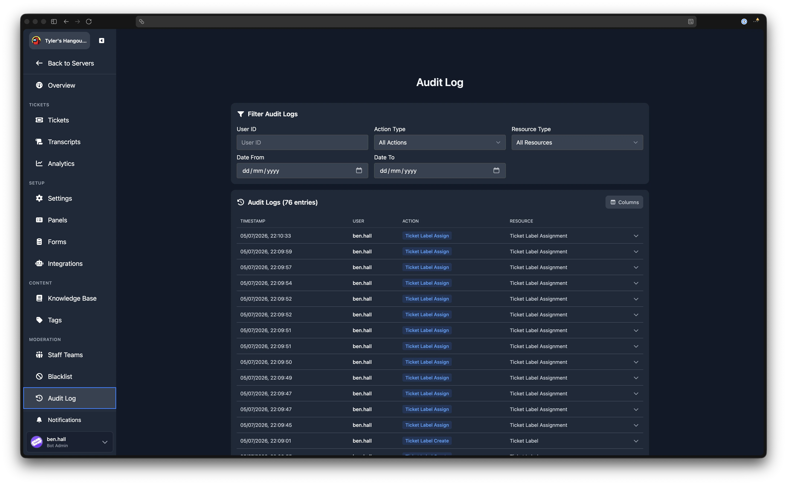
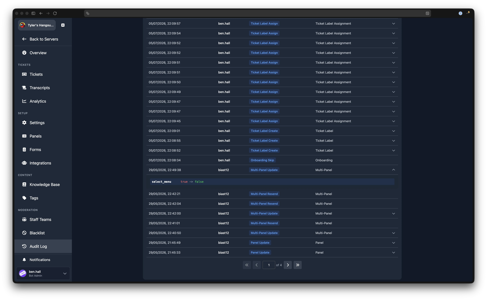

# Audit Log

The Audit Log records every change made through the dashboard by your staff. Use it to track who changed what and when, and to review exactly what was modified.

## Filters

The filter card at the top of the page lets you narrow down the entries shown. All filters are applied together. Filters update the results automatically as you type or select values.

| Filter | Description |
|--------|-------------|
| **User ID** | Show only entries from a specific user. Enter a Discord user ID. |
| **Action Type** | Filter by the type of action performed (e.g. Panel Create, Settings Update). Select from the dropdown, or choose "All Actions" to clear. |
| **Resource Type** | Filter by the type of resource affected (e.g. Panel, Tag, Team). Select from the dropdown, or choose "All Resources" to clear. |
| **Date From** | Show only entries on or after this date. |
| **Date To** | Show only entries on or before this date. |

## Audit Log Table

Below the filters, the audit log entries are displayed in a paginated table. The total number of matching entries is shown in the header. You can show or hide columns using the column selector.

The default columns are:

| Column | Description |
|--------|-------------|
| **Timestamp** | When the action was performed. |
| **User** | The Discord username of the staff member who performed the action. |
| **Action** | The specific action taken (e.g. "Panel Update", "Tag Create", "Ticket Close"). |
| **Resource** | The type of resource that was affected (e.g. "Panel", "Tag", "Ticket"). |

### Action Types

The audit log tracks a wide range of actions across your server. Some common examples include:

- **Settings Update** for changes to server-wide settings
- **Panel Create**, **Panel Update**, **Panel Delete**, **Panel Resend** for ticket panel changes
- **Multi-Panel Create**, **Multi-Panel Update**, **Multi-Panel Delete** for multi-panel changes
- **Form Create**, **Form Update**, **Form Delete** for opening form changes
- **Tag Create**, **Tag Delete** for tag changes
- **Team Create**, **Team Update**, **Team Delete**, **Team Member Add**, **Team Member Remove** for staff team changes
- **Blacklist Add**, **Blacklist Remove User**, **Blacklist Remove Role** for blacklist changes
- **Ticket Send Message**, **Ticket Close**, **Ticket Close Request** for ticket actions taken from the dashboard
- **Ticket Label Create**, **Ticket Label Delete**, **Ticket Label Assign** for label management

### Viewing Changes

If an entry recorded what changed (old and new values), a chevron icon appears on the right side of the row. Click the row to expand it and see the diff.

The diff view highlights which fields were added, removed, or modified. For structured data such as panel settings or form inputs, each changed field is shown alongside its previous and new value.

If the entry includes metadata (additional context about the action), it is displayed below the diff in a formatted block.

## Pagination

Results are paginated. Use the page controls at the bottom of the table to navigate between pages.
