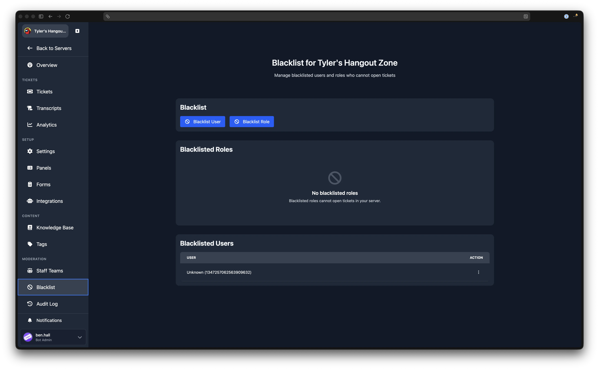
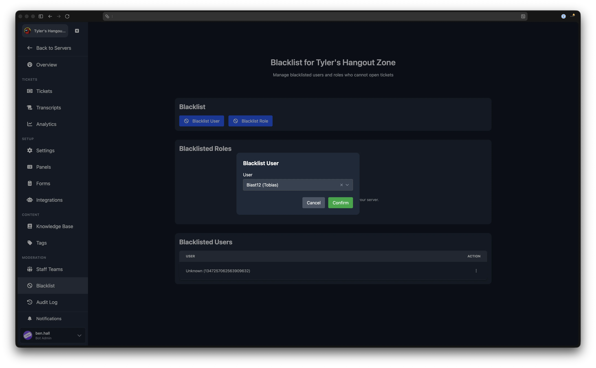

# Blacklist

---

The blacklist prevents specific users or roles from opening tickets in your server. Blacklisted users and roles see an error when they attempt to create a ticket.

## Blacklist Page

Navigate to **Dashboard** > your server > **Blacklist** (in the Moderation sidebar group).

The page has three sections: action buttons at the top, followed by the **Blacklisted Roles** table and the **Blacklisted Users** table.

## Blacklisting a User

Click the **Blacklist User** button to open a modal with a user search field. Start typing a username to search for server members, then select the user you want to blacklist and click **Confirm**.

You can also enter a user ID directly if you know it (useful for users who have left the server). The search field accepts raw user IDs as well as usernames.

Once confirmed, the user appears in the **Blacklisted Users** table, showing their username and ID.

## Blacklisting a Role

Click the **Blacklist Role** button to open a modal with a role selector dropdown listing all roles in your Discord server. Select the role you want to blacklist and click **Confirm**.

Once confirmed, the role appears in the **Blacklisted Roles** table.

## Removing from the Blacklist

To restore a user or role's ability to open tickets, open the action menu in the corresponding table row and click **Remove**. A confirmation dialog appears before the entry is removed.

## Blacklisted Users Table

Shows all blacklisted users with their username and user ID. If the username cannot be resolved (for example, the user has left the server), the entry displays as "Unknown" with the user ID.

The table paginates when there are many entries, with page controls at the bottom.

## Blacklisted Roles Table

Shows all blacklisted roles by name. If a role has been deleted from Discord, it displays as "Unknown" with the role ID.

## Using the /blacklist Command

Users can also be blacklisted via the `/blacklist` command in Discord. See the [commands list](/commands/list-of-commands) for usage details. Entries added via the command appear in the dashboard, and entries added via the dashboard work in Discord, as both manage the same underlying blacklist.
