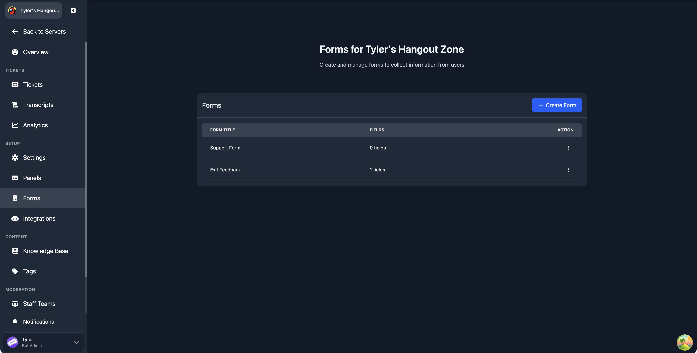
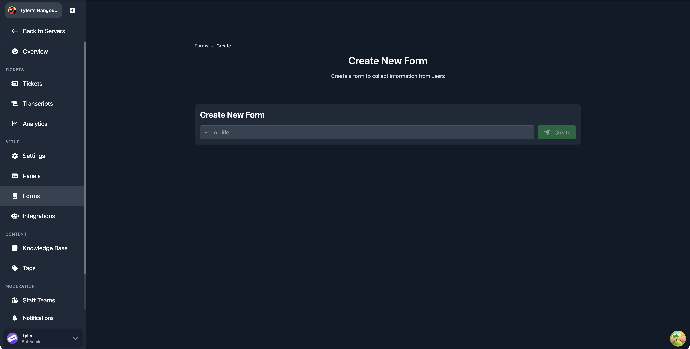
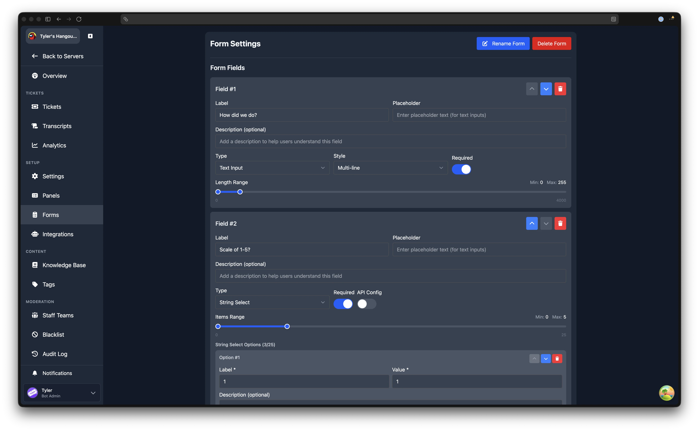

# Forms

---

Forms let you collect structured information from users when they open a ticket. Each form contains up to five fields with a variety of input types, from free text to dropdown selects and checkboxes.

To use a form, create it in the dashboard, add fields, then assign it to a [ticket panel](/dashboard/ticket-panels). A single form can be assigned to multiple panels.

## Forms List

Navigate to **Dashboard** > your server > **Forms** (in the Setup sidebar group).

The main page shows a table of all your forms with two columns: **Form Title** and **Fields** (the number of fields on that form). Each row has an action menu with the following options:

- **Edit** opens the form editor
- **Clone** duplicates the form (see [Cloning a Form](#cloning-a-form))
- **Publish to Gallery** submits the form to the public gallery for other servers to import
- **Remove** deletes the form after a confirmation prompt

Click **Create Form** to start building a new form.

## Creating a Form

1. Click **Create Form** on the forms list page.
2. Enter a title for your form in the **Form Title** field and click **Create**.
3. You are redirected to the form editor where you can add fields.

## Form Editor

The editor page shows the form title at the top (with a **Rename Form** button) and the list of fields below. Click **New Field** to add a field, or use the arrow and delete buttons on each field to reorder or remove them.

### Field Limit

Each form supports a maximum of **5 fields**. Once you reach five, the "New Field" button is replaced by a message confirming the limit has been reached.

### Field Settings

Every field has the following settings:

| Setting | Description |
| ------- | ----------- |
| **Label** | The question or prompt shown to the user. Required, maximum 45 characters. |
| **Placeholder** | Hint text shown inside the input before the user types (for text inputs). |
| **Description** | Optional helper text displayed below the label, maximum 100 characters. |
| **Type** | The kind of input. See [Field Types](#field-types) below. |
| **Style** | For Text Input fields only: Single-line or Multi-line. |
| **Required** | Whether the user must fill in this field before submitting. |
| **Length Range / Items Range** | Minimum and maximum character count (for text) or selection count (for select types). |

Fields can be reordered using the up and down arrow buttons, and deleted using the bin button.

### Field Types

| Type | Description |
| ---- | ----------- |
| **Text Input** | Free text entry. Choose between Single-line and Multi-line style. Maximum 4,000 characters. |
| **String Select** | A dropdown menu where the user picks from a list of options you define (up to 25). Supports [API-based options](/features/api-form-inputs). |
| **User Select** | A dropdown that lists server members for the user to select. |
| **Role Select** | A dropdown that lists server roles for the user to select. |
| **Mentionable Select** | A dropdown that lists both users and roles for the user to select. |
| **Channel Select** | A dropdown that lists server channels for the user to select. |
| **Radio Group** | A set of radio buttons where the user picks exactly one option (2 to 10 options). |
| **Checkbox Group** | A set of checkboxes where the user can select multiple options (1 to 10 options). |

### Options for Select, Radio, and Checkbox Types

For **String Select**, **Radio Group**, and **Checkbox Group** fields, you define the options manually. Each option has:

- **Label** (required): the text displayed to the user
- **Value** (required): the value submitted when the option is selected
- **Description** (optional): additional text shown below the label

Options can be reordered, edited, and removed individually. String Select fields support up to 25 options; Radio Group and Checkbox Group fields support up to 10 each.

:::info Minimum Option Counts
Radio Group requires at least 2 options, since a single radio button would serve no purpose. String Select and Checkbox Group require at least 1 option.
:::

### API-Based Options for String Select

String Select fields can fetch their options dynamically from an external API instead of using a fixed list. Toggle **API Config** next to the Required toggle to reveal the API configuration. See the [API-based form inputs](/features/api-form-inputs) guide for full setup instructions.

## Saving Changes

After adding or editing fields, click **Save Changes** at the bottom of the page. The button is disabled if any field has validation errors (missing label, blank options, duplicate values, or an incomplete or invalid API configuration).

## Cloning a Form

On the forms list page, open the action menu for any form and click **Clone**. This creates a new form titled `<original title> (Copy)` with all of the original form's fields copied over, including labels, placeholders, types, options, and settings. You are taken to the editor for the new form, where you can rename it and adjust fields as needed.

## Deleting a Form

On the forms list page, open the action menu and click **Remove**. A confirmation dialog appears asking you to confirm. Deletion is permanent.

On the editor page, you can also delete the current form using the **Delete Form** button.

## Assigning a Form to a Panel

Once your form is saved, head to [Ticket Panels](/dashboard/ticket-panels) and create or edit a panel. In the panel settings, select your form from the **Form** dropdown. Save the panel, and the form will be shown to users when they click the panel button.

When using [multi-panels](/dashboard/multi-panels), the form shown to the user is the one assigned to the specific panel button or dropdown item they interact with.

## Publishing to Gallery

You can share your form with other Tickets users by publishing it to the gallery. Open the action menu for a form on the list page and click **Publish to Gallery**. Other server admins can then import your form directly from the gallery.
