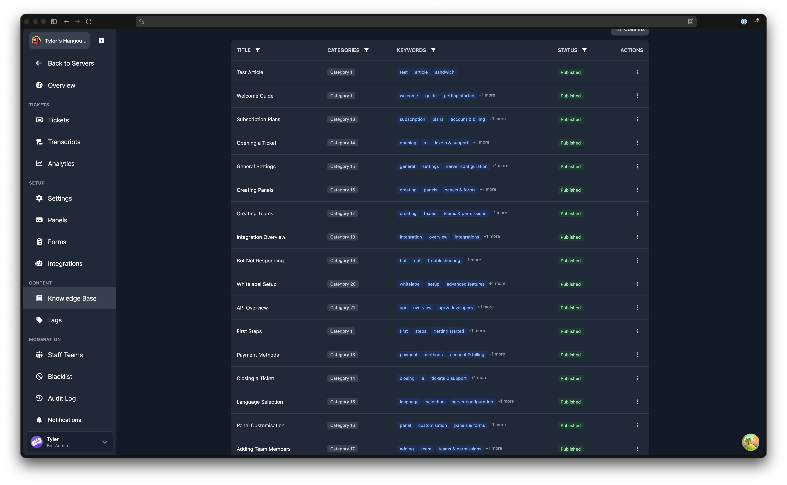
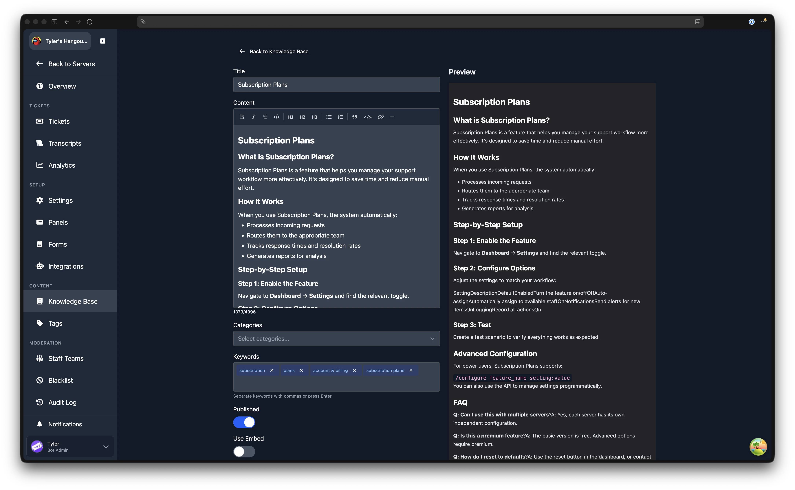
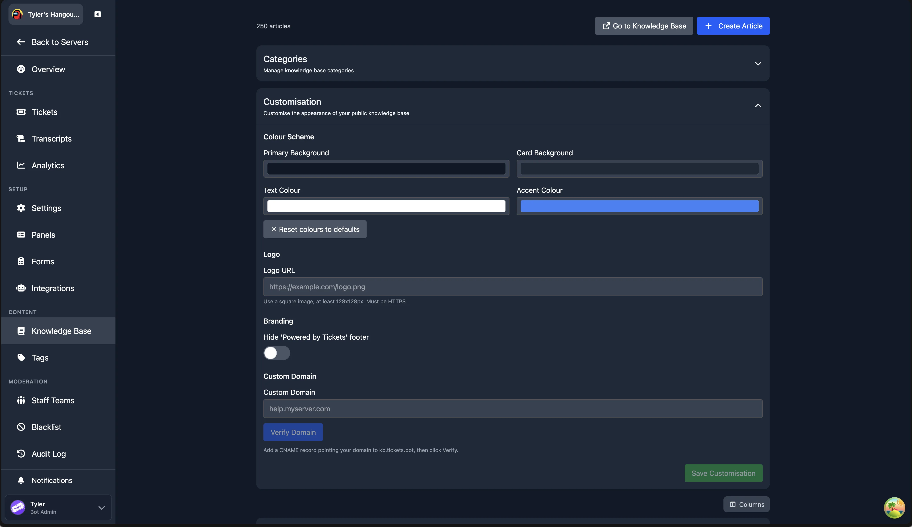

# Knowledge Base

The Knowledge Base lets you create help articles that users can browse before opening a ticket. Articles can be searched in Discord using slash commands, automatically suggested when users open tickets, and viewed on a public web page.

## Overview

The Knowledge Base system has three parts:

1. **Dashboard management**: create, edit, and organise articles from the web dashboard
2. **Discord commands**: users can search and browse articles with `/kb`, staff can send articles into tickets with `/kb send`
3. **Public web page**: a shareable URL where anyone can browse your knowledge base

## Managing Articles

Navigate to **Dashboard** > your server > **Knowledge Base** (in the Content sidebar group).

The top of the page shows an article count and two buttons: **Go to Knowledge Base** (opens your public KB page) and **Create Article**.



### Creating an Article

1. Click **Create Article**
2. Fill in the **Title** (required, maximum 100 characters)
3. Write your **Content** using the markdown editor (maximum 4,096 characters). The editor supports headings, bold, italic, strikethrough, lists, blockquotes, code blocks, links, and horizontal rules. A live preview is shown to the right.
4. Select **Categories** to organise the article (optional)
5. Add **Keywords** to help users find the article through search. Separate keywords with commas or press Enter. Keywords are shown as removable badges.
6. Toggle **Published** to control whether the article is visible to users
7. Optionally toggle **Use Embed** to attach a Discord embed to the article (see below)
8. Click **Create Article** to save



:::tip Add a Custom Embed
You can also add a custom Discord embed to your article, similar to how embeds work on [Tags](/dashboard/tags). This is useful for visually rich responses when articles are sent into tickets.

[Placeholders](/miscellaneous/placeholders) in the embed are filled in when the article reaches a ticket through a linked tag.
:::

### Editing an Article

Click the **Edit** action on any article in the table. The edit page shows the same form as creation, pre-populated with the article's current content. Click **Save Changes** when done.

### Article Table

The article table shows all your articles with sortable, filterable columns:

- **Title**: click the filter icon to search by title, or sort alphabetically, by position, or by last updated
- **Categories**: filter by one or more categories using the checkbox dropdown
- **Keywords**: search across keyword values
- **Status**: filter by Published, Draft, or All

You can choose which columns to display using the column selector button above the table.

The table paginates at 20 articles per page. Use the page controls at the bottom to navigate.

### Drafts

Articles can be saved as **Draft** by toggling the Published switch off. Draft articles:

- Are visible to admins in the web dashboard
- Do **not** appear in Discord search results
- Do **not** appear on the public knowledge base page
- Can be published at any time by editing and toggling Published on

## Categories

Categories help organise articles into groups. Users can browse articles by category both in Discord and on the web page.

### Managing Categories

1. Open the **Categories** collapsible section on the Knowledge Base page
2. Type a category name and click **Add**
3. Existing categories are listed below, each with a delete button
4. Deleting a category removes the association but does not delete articles

You can filter the article table by category to see which articles belong to each group.

## Customisation

The Customisation section lets you control the look of your public knowledge base page. Open the **Customisation** collapsible section on the Knowledge Base page.

:::warning Premium Required
Customisation settings require Premium. Without Premium, the settings are shown but locked behind a "View Premium Plans" prompt.
:::

### Colour Scheme

Four colour pickers control the public KB page appearance:

| Setting | Default | Description |
| ------- | ------- | ----------- |
| **Primary Background** | `#111827` | The main page background colour |
| **Card Background** | `#1F2937` | The background colour for article cards |
| **Text Colour** | `#FFFFFF` | The primary text colour |
| **Accent Colour** | `#3B82F6` | The colour used for links and interactive elements |

The dashboard checks colour contrast and shows a warning if your text or accent colour does not meet WCAG accessibility guidelines against the selected backgrounds.

Click **Reset colours to defaults** to restore the original colour scheme.

### Logo

Enter a **Logo URL** to display your own logo on the public knowledge base page. The image should be square, at least 128x128 pixels, and served over HTTPS. A preview thumbnail appears next to the input.

### Branding

Toggle **Hide 'Powered by Tickets' footer** to remove the Tickets branding from the bottom of your public knowledge base page.

Click **Save Customisation** at the bottom of the section to apply all changes.



## Discord Commands

### `/kb search <query>`

Search for articles by keyword. The bot returns matching articles as an ephemeral message (only visible to the person who ran the command). Supports autocomplete: start typing and matching article titles appear.

### `/kb browse [category]`

Browse articles by category. Without a category, shows all available categories. With a category selected, lists articles in that category.

### `/kb send <article>`

**Staff only.** Send a knowledge base article as a permanent message in the current channel. Useful for sharing articles with users during a ticket conversation. The article renders as a Discord embed with its full content.

:::tip Autocomplete Is Supported
All `/kb` commands support autocomplete. Start typing an article name or category and matching suggestions will appear.
:::

## Linking Tags to KB Articles

Tags can be linked to Knowledge Base articles. When a linked tag is used via `/tag`, it renders the KB article's content instead of the tag's own content. This avoids duplicating content between tags and KB articles.

### Setting Up a Linked Tag

1. Go to **Dashboard** > **Tags**
2. Create or edit a tag
3. Toggle **Link to Knowledge Base article**
4. Select the article from the dropdown
5. Save the tag

When the tag is invoked in Discord, the linked article's content (including any embed) is displayed. If the linked article is later deleted or unpublished, the tag falls back to its own content.

:::tip Edit Once, Update Everywhere
This is great for keeping canned responses in sync with your knowledge base. Edit the KB article once, and all linked tags automatically use the updated content.
:::

## Public Knowledge Base

Your server's knowledge base is available at a public URL that anyone can visit without being in your Discord server:

```text
https://kb.tickets.bot/kb/<your-guild-id>
```

The public page features:

- **Search**: full-text search across article titles, content, and keywords
- **Category browsing**: filter articles by category
- **Article pages**: each article has its own shareable URL
- **Related articles**: articles in the same category are shown as suggestions

### Sharing Articles

Each article has a shareable URL in the format:

```text
https://kb.tickets.bot/kb/<guild-id>/<article-slug>
```

You can share these links in Discord messages, on your website, or anywhere else. The article slug is automatically generated from the title.

## Freemium Limits

| Feature | Free | Premium |
| ------- | ---- | ------- |
| Articles | Up to 5 | Unlimited |
| Categories | Up to 3 | Unlimited |
| `/kb` commands | Yes | Yes |
| Public knowledge base | Yes | Yes |
| Tag to KB linking | Yes | Yes |
| Customisation (colours, logo, branding) | No | Yes |

## Markdown Editor

The article content editor supports rich text formatting through a toolbar:

| Button | Format | Discord Support |
| ------ | ------ | --------------- |
| **B** | Bold | Yes |
| *I* | Italic | Yes |
| ~~S~~ | Strikethrough | Yes |
| `</>` | Inline code | Yes |
| H1/H2/H3 | Headings | Yes |
| Bullet list | Unordered list | Yes |
| Numbered list | Ordered list | Yes |
| Blockquote | Quote | Yes |
| Code block | Fenced code | Yes |
| Link | Hyperlink | Yes |
| Horizontal rule | Divider | Yes |

Content is stored as Markdown, which renders natively in Discord messages and on the web knowledge base page. The editor shows a live preview of how the formatted content will appear.
