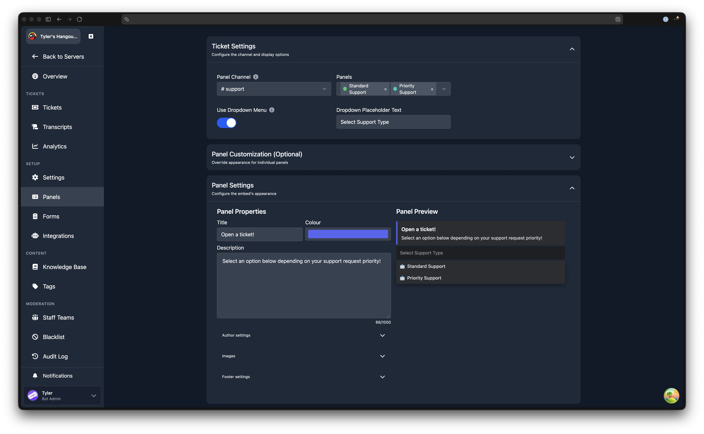
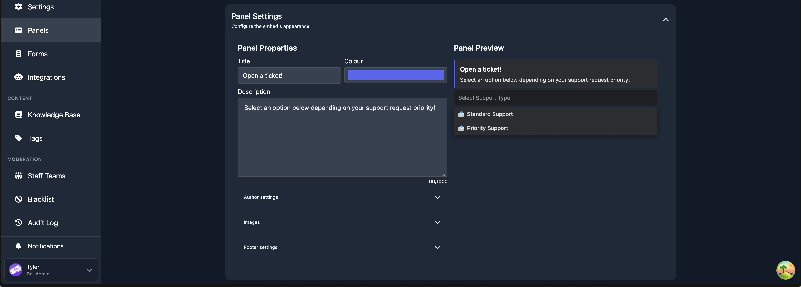

# Multi-Panels

---

Multi-panels combine two or more ticket panels into a single embed message. Instead of posting each panel separately, you can present all of your ticket types in one place, either as a row of buttons or as a dropdown menu.

You need at least two existing panels before you can create a multi-panel. If you have not created any panels yet, follow the [Panels](/dashboard/ticket-panels) guide first.

## Creating a Multi-Panel

Open the dashboard, select your server, and click **Panels** in the sidebar. The **Multi-Panels** section is on the right side of the page. Click **Create Multi-Panel** to open the editor.

The editor is divided into three sections described below. After configuring the multi-panel, click **Create Multi Panel** at the bottom of the page.

## Editing a Multi-Panel

From the Panels page, click the action menu on any multi-panel row and select **Edit**. The same editor opens with the multi-panel's current settings. After making changes, click **Save Changes**.

To resend a multi-panel (for example, if the message was deleted in Discord), click **Resend** in the action menu. To delete a multi-panel, click **Remove**. Deleting the message in Discord does not remove the multi-panel from the dashboard; you can resend it at any time.

## Ticket Settings

Controls which panels are included and how they are presented.

### Panel Channel

The Discord text channel where the bot sends the multi-panel embed. This should be a channel accessible to all members.

:::warning Use a Separate Channel
Do not use the same channel as your transcript channel.
:::

### Panels

Select the individual panels to include in this multi-panel. Each panel must already exist. You must select at least 2 and can include up to 15.

### Use Dropdown Menu

Toggle between two display modes:

- **Enabled** - the panels appear as a dropdown select menu beneath the embed. Each panel must have a label (either its own button text or a custom label set in the Panel Customization section).
- **Disabled** - the panels appear as individual buttons beneath the embed.

Click the info icon next to the toggle for a visual comparison of both modes.

### Dropdown Placeholder Text

Only available when the dropdown menu is enabled. Sets the placeholder text shown in the dropdown before the user makes a selection (e.g. "Select a category").

## Panel Customization (Optional)

Override the appearance of individual panels within this multi-panel. Each panel you selected in the Ticket Settings section appears as a card with the following fields:

### Custom Emoji

Override the emoji shown on this panel's button (or in the dropdown). Leave empty to use the panel's default emoji.

### Custom Label

Override the text label shown on this panel's button (or in the dropdown). Leave empty to use the panel's default button text.

:::warning Dropdown Mode Requires Labels
When using dropdown mode, every panel must have a label. If a panel has neither a custom label here nor a button text on the panel itself, the editor will show an error and prevent you from saving.
:::

### Description

Only available when dropdown mode is enabled. An optional short description shown beneath the panel's label in the dropdown menu.

## Panel Settings

Controls the appearance of the multi-panel embed itself. A live preview is shown on the right side of the editor.

### Title

The bold text at the top of the embed.

### Colour

The accent colour on the left edge of the embed. Click the colour picker to choose a custom colour.

### Description

The main body text of the embed. Maximum length: 1,000 characters.

### Author Settings

An expandable sub-section with fields for:

- **Author Name** - text displayed above the embed title.
- **Author Icon URL** - a small image displayed next to the author name.
- **Author URL** - a link that the author name points to when clicked.

### Images

An expandable sub-section with fields for:

- **Thumbnail URL** - a small image shown to the right of the embed content.
- **Image URL** - a large image shown below the embed content.

:::tip Image URLs
The URL should point directly to an image file. An easy way to get a suitable URL is to send the image as a message in a Discord channel, then right-click the image and choose **Copy Link**.
:::

### Footer Settings

An expandable sub-section with fields for:

- **Footer Text** - text displayed at the bottom of the embed.
- **Footer Icon URL** - a small image displayed next to the footer text.
- **Footer Timestamp (Optional)** - a date and time displayed next to the footer.
