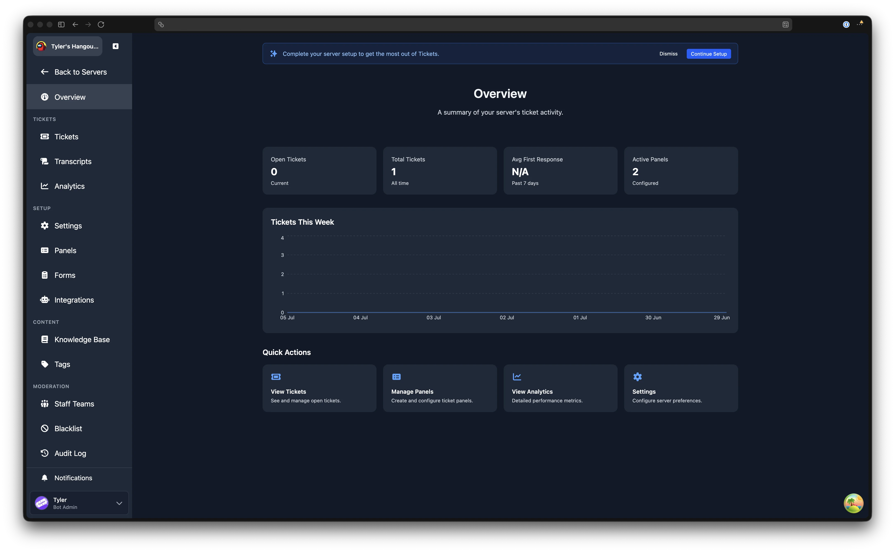
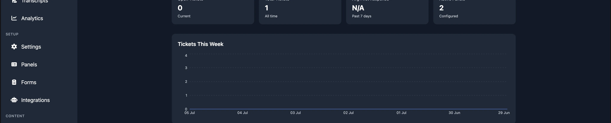
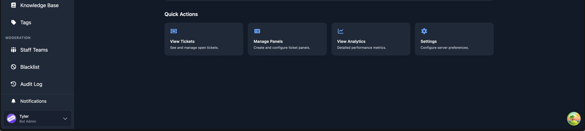

# Overview

The Overview page is the first thing you see after selecting a server in the dashboard. It provides a summary of your server's ticket activity and quick links to common actions.

## Stat Cards

At the top of the page, stat cards display key numbers at a glance. All servers see two cards:

| Card | Description |
|------|-------------|
| **Open Tickets** | The number of tickets currently open in your server. |
| **Total Tickets** | The total number of tickets ever created in your server. |

Premium servers see two additional cards:

| Card | Description |
|------|-------------|
| **Avg First Response** | The average time until a staff member first replies, measured over the past 7 days. |
| **Active Panels** | The number of [ticket panels](./ticket-panels) currently configured in your server. |

## Tickets This Week

Below the stat cards, a chart shows your ticket volume over the past seven days. Each point represents the number of tickets created on that date. Hover over the chart to see the exact count for a given day.

If no tickets were created during the period, a message is shown instead.

## Quick Actions

At the bottom of the page, Quick Actions cards provide shortcuts to the pages you are most likely to visit. The cards shown depend on your permission level and premium status:

| Card | Description | Requires |
|------|-------------|----------|
| **View Tickets** | Opens the [Tickets](./tickets) page. | Support or Admin |
| **Manage Panels** | Opens the [Ticket Panels](./ticket-panels) page. | Admin |
| **View Analytics** | Opens the [Analytics](./analytics) page. | Premium |
| **Settings** | Opens the [Settings](./settings/settings) page. | Admin |

