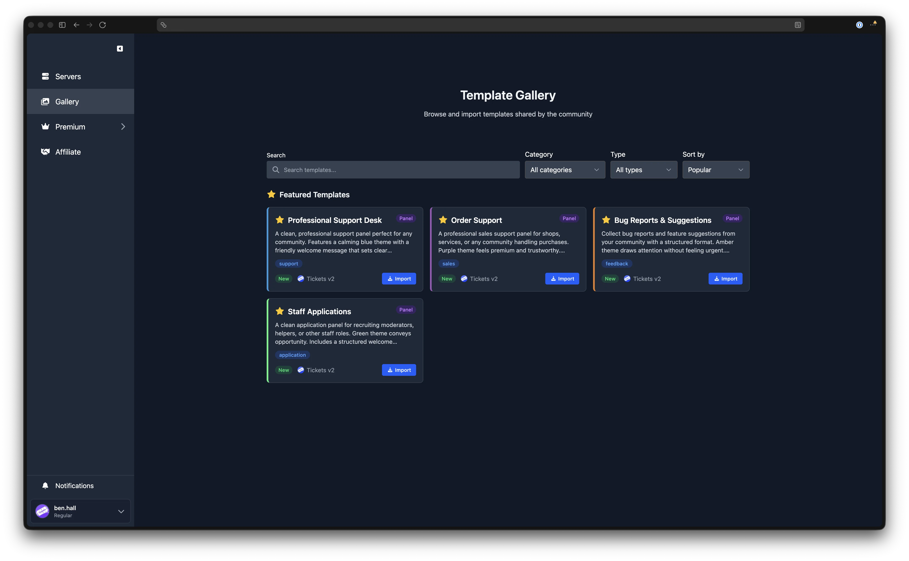
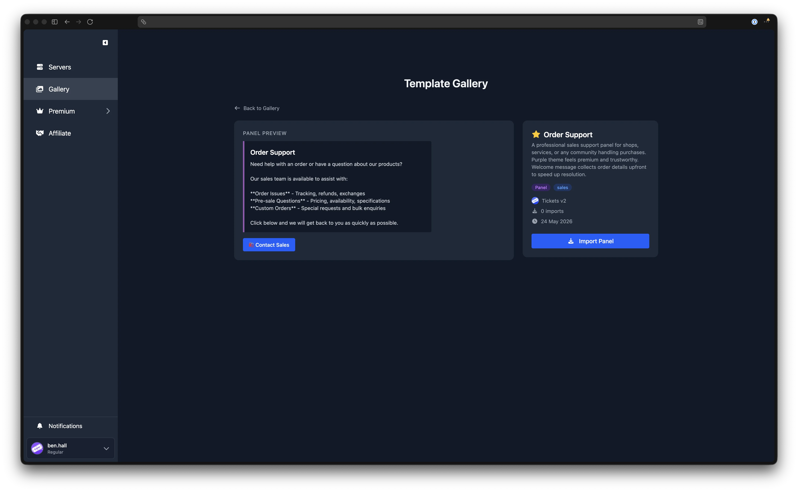

# Template Gallery

---

The Template Gallery is a community-driven collection of pre-made templates. You can browse panels, tags, and forms shared by other server admins, import them into your own server, or publish your own designs for others to use.

## Browsing the Gallery

To open the gallery, click **Browse Gallery** on the [Panels](/dashboard/ticket-panels) page, or navigate to the gallery directly from the sidebar.

The gallery supports several ways to find templates:

- **Search** - type in the search bar to filter templates by name.
- **Category** - narrow results by category (e.g. Support, Moderation, Applications). Select "All categories" to clear the filter.
- **Type** - filter by template type: Panels, Tags, or Forms.
- **Sort** - order results by **Popular** (most imported) or **Newest** (most recently published).
- **Clear** - click the clear button to reset all filters at once.

Each gallery card shows the template's name, description, category, type, tags, and the number of times it has been imported.

### Featured Templates

On the first page, when no filters are active, a **Featured Templates** section highlights curated templates at the top of the gallery.

### Template Detail Page

Click any gallery card to view the full detail page. This shows a larger preview of the template (panel embed, tag content, or form fields), the author's name, the date it was published, the import count, and the template's tags and category.

## Importing a Template

To import a template into your server:

1. Find a template you like and click **Import Panel**, **Import Tag**, or **Import Form** (the label matches the template type).
2. Select the server you would like to import it into.
3. For panels, you can optionally choose a **channel** for the panel and a **category** for new tickets.
4. Click **Import**. The template is created in your server.
5. For panels, you are redirected to the panel editor where you can customise server-specific settings such as support teams, forms, access control, and more.

:::tip Imports Are Fully Editable
Importing a template gives you a fully editable copy. You are free to change any settings after import.
:::

## Publishing a Template

To share one of your templates with the community:

1. Head to the appropriate page on the dashboard:
   - **Panels**: go to the Panels page, click the action menu on a panel, and select **Publish to Gallery**.
   - **Tags and Forms**: publishing is available from their respective pages in the same way.
2. Fill in the required details in the submission modal:
   - **Name** - a clear, descriptive title for your template (up to 100 characters).
   - **Description** - a short summary of what the template is designed for (up to 500 characters).
   - **Category** - choose the most relevant category (see [Categories](#categories) below).
   - **Tags** (optional) - add up to 3 tags to help others find your template.
3. Click **Submit for Review**.

:::warning Submission Requirements
Please ensure your template has a descriptive title, meaningful content, and no server-specific references. Custom Discord emojis are not supported in gallery submissions; use standard Unicode emojis instead.
:::

## Submission Review

After you submit a template to the gallery, it enters a review queue. Submissions are typically reviewed within 48 hours.

You can check the status of your submissions on the **Panels** page in the **Gallery Submissions** section. Each submission shows one of three statuses:

| Status | Meaning |
|---|---|
| Pending | Awaiting review |
| Approved | Published and visible in the gallery |
| Rejected | Not accepted; a reason is provided so you can make changes and resubmit |

## Managing Your Submissions

From the Gallery Submissions section on the Panels page, you can:

- **Edit** a submission to update its name, description, category, or tags. If the source template has changed, editing will also re-submit the latest version for review.
- **Withdraw** a pending submission to cancel it before it is reviewed.
- **Unpublish** an approved submission to remove it from the gallery. Servers that have already imported it keep their copy.

## Categories

When publishing a template, choose from the following categories:

| Category | Description |
|---|---|
| Support | Customer support and help desks |
| Moderation | Ban appeals, reports, rule violations |
| Sales | Orders, purchases, commercial enquiries |
| Applications | Staff recruitment, team tryouts, sign-ups |
| Feedback | Suggestions, bug reports, feature requests |
| General | Other designs that do not fit the above |
| Other | Anything else |

## What Gets Shared

When you publish a panel to the gallery, only the panel's **visual design** is shared. This includes:

- Panel title and content
- Embed colour
- Button style, text, and emoji
- Welcome message
- Image URLs

Server-specific settings are **not** shared. The following are left for importers to configure themselves:

- Panel channel and ticket category
- Support teams
- Forms
- Access control rules
- Mention on open settings
- Naming scheme
- Support hours

This means your server's private configuration stays private. Only the look and feel of the template is published.
