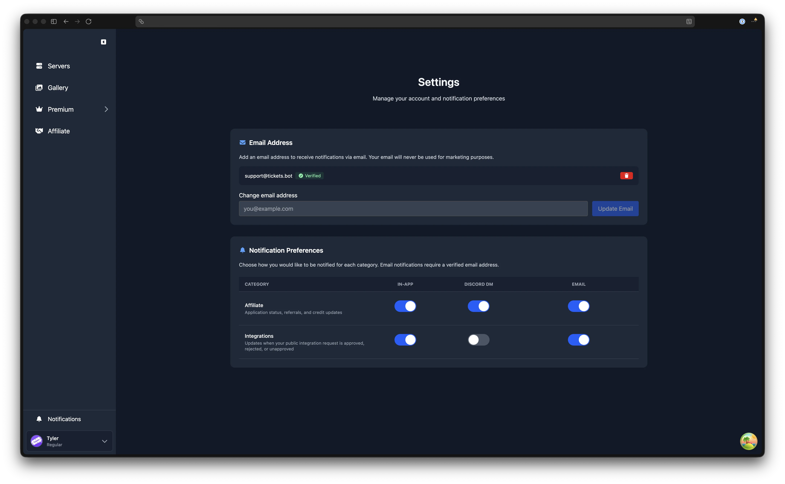

# User Settings

The User Settings page is where you manage your email address and notification preferences. These settings apply to your account across all servers, they are not tied to any individual server.

To access your settings, click on your avatar in the sidebar footer to open the account menu, then select **Settings**.

## Email Address

You can optionally add an email address to your account. Your email is used for transactional notifications only, Tickets will never send you marketing emails.

### Adding and Verifying Your Email

1. Open the **Settings** page
2. Enter your email address and click **Add Email**
3. A **6-digit verification code** is sent to the address you provided
4. Enter the code on the Settings page and click **Verify** to complete verification

::: tip Verify to Unlock Email Notifications
You must verify your email before any email notifications can be sent to it. Until verification is complete, the email notification channel remains unavailable.
:::

::: warning Verification Code Expiry
The verification code expires after **15 minutes**. If it expires, you can request a new one by clicking **Resend code** on the Settings page.
:::

### Changing or Removing Your Email

- You can **change** your email address at any time by entering a new address and clicking **Update Email**. Changing it resets your verification status, and you will need to verify the new address before email notifications resume.
- You can **remove** your email entirely by clicking the delete button next to your email address. A confirmation prompt will appear before the address is removed. Removing your email disables all email notifications immediately.

## Notification Preferences

You can choose how you receive notifications for different event categories. Three notification channels are available:

| Channel | Description |
| ------- | ----------- |
| **In-app** | Notifications appear in the web dashboard via the bell icon in the sidebar |
| **Discord DM** | The bot sends you a direct message on Discord |
| **Email** | Sent to your verified email address |

By default, **In-app** is enabled while **Discord DM** and **Email** are disabled. You can toggle each channel on or off independently for every notification category.

::: warning Discord DMs
For Discord DM notifications to work, your DMs must be open. The bot needs to be able to send you a direct message. If your privacy settings block DMs from server members, you will not receive these notifications.
:::

### Notification Categories

| Category | What You Are Notified About |
| -------- | --------------------------- |
| **Affiliate** | Referral activity, credit updates, and application status changes |
| **Integrations** | Updates when your public integration request is approved, rejected, or unapproved |

Each row in the notification preferences table shows a category with its description, along with toggle switches for In-app, Discord DM, and Email. Toggle each channel on or off as needed, then click **Save Preferences** to apply your changes.

::: tip Email Channel Warning
If you enable the Email channel for a category but have not yet added and verified an email address, a warning will appear next to the toggle reading "Needs verified email". You will not receive email notifications until your email is verified.
:::

## Notifications

Access your notifications by clicking the **bell icon** in the sidebar footer. A blue dot on the bell icon indicates you have unread notifications. For full details on the Notifications page, see [Notifications](/dashboard/notifications).
