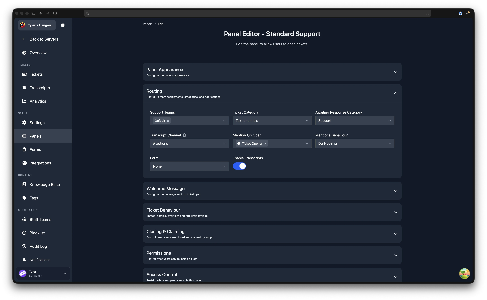

# Awaiting Response Category

The awaiting response category automatically moves a ticket channel to a separate Discord category when the ticket is waiting for the user to reply. This helps staff quickly see which tickets need their attention and which are waiting on the user.

:::info Channel Mode Only
This feature is channel mode only. Discord does not allow threads to be moved between categories. See the [mode comparison](/dashboard/settings/thread-mode#mode-comparison) for differences between the two modes.
:::

:::tip Premium Feature
The awaiting response category requires [Premium](https://tickets.bot/premium).
:::

## How It Works

When a staff member sends a message in a ticket, the ticket is considered to be awaiting a response from the user. After a short delay, the ticket channel is moved to the configured awaiting response category. When the user replies, the channel is moved back to the panel's main ticket category.

Due to Discord rate limits, a channel can only be updated twice every 10 minutes. The move happens approximately 10 minutes after the last staff response.

## Configuration

The awaiting response category is set per panel. Open any panel from the [Panels](/dashboard/ticket-panels) page, expand the **Routing** section, and select a Discord category in the **Awaiting Response Category** dropdown.

