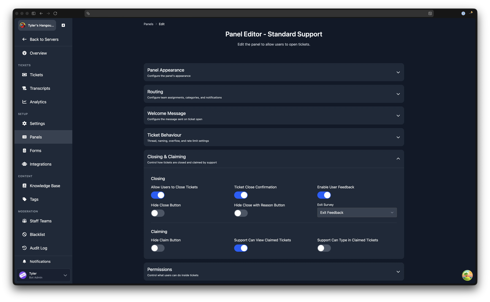

# Claiming Tickets

:::info Channel Mode Only
Claiming is only available in channel mode. In thread mode, staff members join tickets individually by clicking a button, which provides similar behaviour. See the [mode comparison](/dashboard/settings/thread-mode#mode-comparison) for details.
:::

When a staff member claims a ticket, they take ownership of it. This keeps conversations focused by preventing multiple staff members from responding at the same time. Administrators with the Discord **Administrator** permission always have access to any claimed ticket.

## Commands

| Command | Description |
|---|---|
| `/claim` | Claim the current ticket for yourself. |
| `/transfer @user` | Transfer the claim to another staff member. |
| `/unclaim` | Release the claim on the current ticket. |

## Dashboard Configuration

Claiming settings are configured per panel. Open any panel from the [Panels](/dashboard/ticket-panels) page, expand the **Closing and Claiming** section, and look under the **Claiming** sub-heading.

The available settings are:

| Setting | Description |
|---|---|
| **Hide Claim Button** | When enabled, the Claim button is not shown in tickets from this panel. Staff can still claim using the `/claim` command. |
| **Support Can View Claimed Tickets** | When enabled, other support staff can see a ticket that has been claimed by a different staff member. When disabled, only the claimer can see the ticket. |
| **Support Can Type in Claimed Tickets** | When enabled, other support staff can send messages in a claimed ticket. This option is only available when **Support Can View Claimed Tickets** is enabled. |

These three settings combine to create common claiming configurations:

- **Default**: all staff can see the ticket, but only the claimer can reply.
- **Full visibility**: all staff can see the ticket and all staff can reply (enable both "view" and "type").
- **Private to claimer**: only the claimer can see the ticket (disable "view").

## Panel Switch Behaviour

When a claimed ticket is switched to a different panel using `/switchpanel`, the claimer may not have access to the new panel's support team. The **Panel Switch Behaviour** setting in [Server Settings](/dashboard/settings/settings#panel-switch-behaviour) controls what happens in this scenario.

| Option | Behaviour |
|---|---|
| **Auto Unclaim** | Automatically unclaim if the claimer has no access to the new panel. This is the default. |
| **Block Switch** | Prevent switching if the claimer has no access to the new panel. The ticket must be unclaimed first. |
| **Remove On Unclaim** | Allow the switch, but remove the claimer's access when they unclaim. |
| **Keep Access** | Allow the switch and keep the claimer's access even after unclaiming. |

:::info When This Applies
This setting only applies when the claimer does not have access to the new panel. If the claimer has access to both panels, the ticket remains claimed and no special handling is needed.
:::
