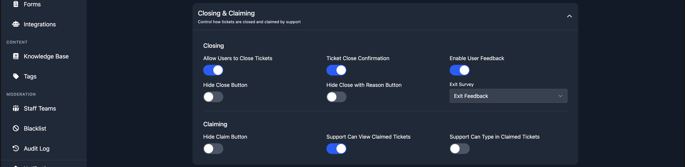

# Exit Survey

An exit survey is a form presented to the user after they close a ticket and leave a star rating. It lets you collect structured written feedback alongside the numeric rating.

:::tip Premium Feature
Exit surveys require [Premium](https://tickets.bot/premium).
:::

## Setting Up an Exit Survey

1. Create a [form](/dashboard/forms) containing your feedback questions.
2. Enable [user feedback](./user-feedback) on the panel (the **Enable User Feedback** toggle in the **Closing and Claiming** section).
3. In the same section, set the **Exit Survey** dropdown to the form you created.

The next time a user rates a ticket on that panel, they will also be prompted to fill in the survey form.

## Viewing Responses

When a user submits a survey response, the archive message in your transcript channel is updated with a button to view their answers.
