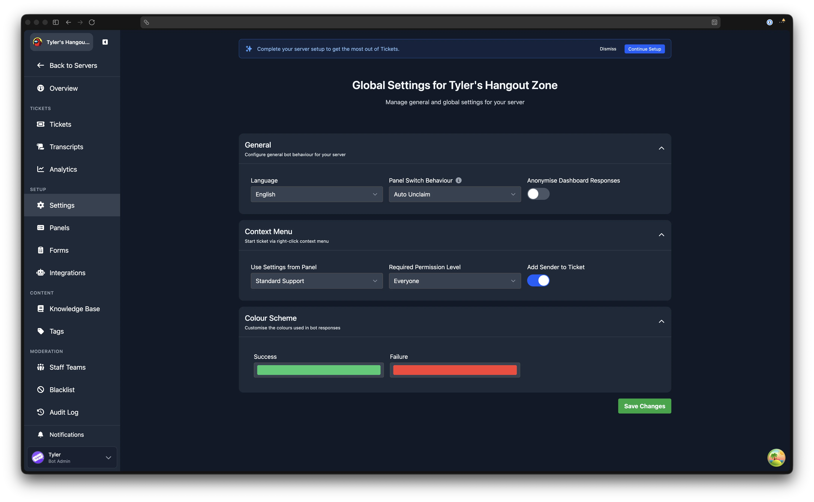
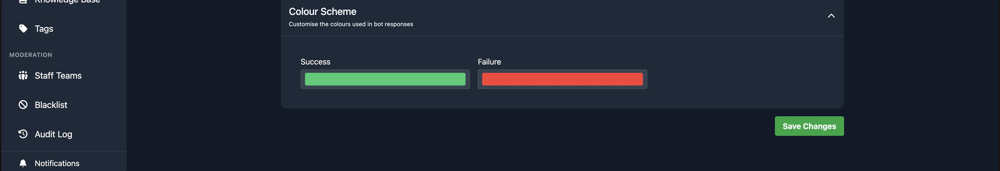

# Server Settings

---

The Server Settings page controls options that apply globally across your server, rather than to individual panels. Open the dashboard, select your server, and click **Settings** in the sidebar.

The page is divided into three collapsible sections: [General](#general), [Context Menu](#context-menu), and [Colour Scheme](#colour-scheme). After making changes, click **Save Changes** at the bottom of the page.

## Looking for a setting that used to be here?

Several settings have moved to the per-panel editor. Each panel now controls its own behaviour independently. Open any panel from the [Panels](/dashboard/ticket-panels) page and look in the section listed below.

| Old Settings location | New location (panel editor section) |
|---|---|
| Allow Users to Close Tickets | [Closing and Claiming](/dashboard/ticket-panels#closing-and-claiming) |
| Ticket Close Confirmation | [Closing and Claiming](/dashboard/ticket-panels#closing-and-claiming) |
| Enable User Feedback | [Closing and Claiming](/dashboard/ticket-panels#closing-and-claiming) |
| Thread Mode (Enabled) | [Ticket Behaviour](/dashboard/ticket-panels#ticket-behaviour) (Create Tickets as Threads) |
| Thread Notification Channel | [Ticket Behaviour](/dashboard/ticket-panels#ticket-behaviour) |
| Transcripts Channel | [Routing](/dashboard/ticket-panels#routing) (Transcript Channel) |
| Store Ticket Transcripts | [Routing](/dashboard/ticket-panels#routing) (Enable Transcripts) |
| Overflow Category | [Ticket Behaviour](/dashboard/ticket-panels#ticket-behaviour) (Enable Overflow Category) |
| Hide Claim Button | [Closing and Claiming](/dashboard/ticket-panels#closing-and-claiming) |
| Hide Close Button | [Closing and Claiming](/dashboard/ticket-panels#closing-and-claiming) |
| Hide Close with Reason Button | [Closing and Claiming](/dashboard/ticket-panels#closing-and-claiming) |
| /open Command settings | [Ticket Behaviour](/dashboard/ticket-panels#ticket-behaviour) (Show in /open Command) |
| Naming Scheme | [Ticket Behaviour](/dashboard/ticket-panels#ticket-behaviour) |
| Welcome Message | [Welcome Message](/dashboard/ticket-panels#welcome-message) |
| Auto Close | [Auto Close](/dashboard/ticket-panels#auto-close) |
| Ticket Permissions | [Permissions](/dashboard/ticket-panels#permissions) |

## General

The General section contains settings that affect the bot across the entire server.

### Language

Select the language the bot uses for all messages in your server. The dropdown lists all available translations.

[Learn more about language customisation](../../setup/language-customisation).

### Panel Switch Behaviour

Controls what happens when a ticket is switched to a different panel and the current claimer does not have access to the new panel's support team. The available options are:

| Option | Behaviour |
|---|---|
| Auto Unclaim | Automatically unclaim if the claimer has no access to the new panel |
| Block Switch | Prevent switching if the claimer has no access to the new panel |
| Remove On Unclaim | Allow the switch, but remove the claimer's access when they unclaim |
| Keep Access | Allow the switch and keep the claimer's access even after unclaiming |

Click the info icon next to the label for a detailed explanation of each option.

### Simultaneous Ticket Limit

The maximum number of tickets a single user can have open across the whole server at once (0-10, default 10). Set it to 0 for no server-wide limit. Staff members are exempt.

It counts every open ticket, whichever panel it came from, and applies alongside each panel's own **Max Open Tickets Per User** rather than replacing it - see [how the two limits combine](/dashboard/ticket-panels#how-the-two-limits-combine).

### Anonymise Dashboard Responses

When enabled, all responses sent from the web dashboard appear as if they were sent by the bot rather than by the individual staff member. This hides the identity of the staff member responding.

## Context Menu

The Context Menu section configures the "Start ticket from message" feature, which lets users right-click a message in Discord and open a ticket from it.

[Learn more about starting a ticket from a message](./start-ticket-from-message).

### Use Settings from Panel

Select a panel whose ticket settings (support teams, category, welcome message, etc.) will be used when a ticket is opened via the context menu. If set to "None", tickets opened this way use default settings.

### Required Permission Level

Controls who can use the context menu to start a ticket. The options are:

- **Everyone** - any server member can use it.
- **Staff Only** - only users with a support role or higher can use it.
- **Admin Only** - only users with an admin role can use it.

### Add Sender to Ticket

When enabled, the user who sent the original message (the one that was right-clicked) is automatically added to the new ticket, even if they are not the one who opened it.

## Colour Scheme

Customise the colours used in the bot's embedded messages across your server. Two colour pickers are available:

- **Success** - the colour used for positive messages (default: green, `#2ecc71`).
- **Failure** - the colour used for error or warning messages (default: red, `#fc3f35`).

:::tip Premium Feature
This is a premium feature. [Learn more about premium](https://tickets.bot/premium).
:::

