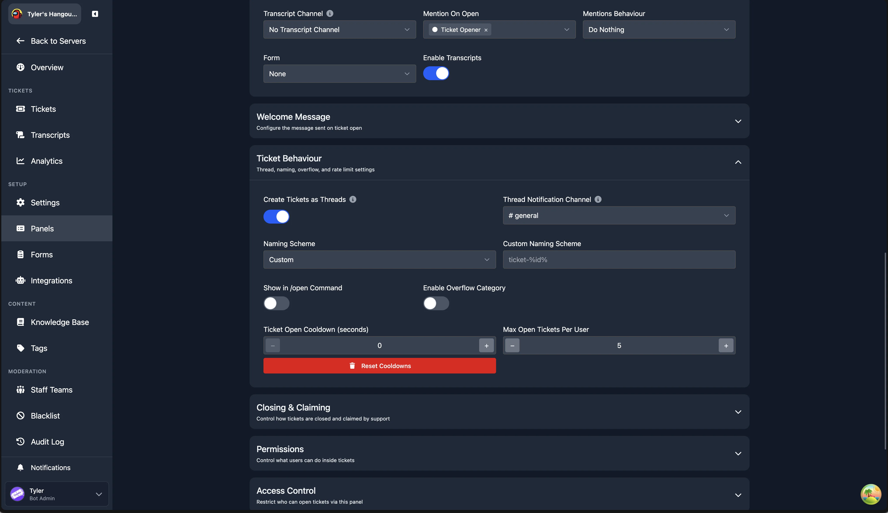

# Thread Mode

Thread mode is an alternative way to create tickets. Instead of opening a separate channel for each ticket, the bot creates a private thread under the panel channel. This changes several aspects of how tickets work, so read the comparison below to decide which mode suits your server.

## Enabling Thread Mode

Thread mode is enabled per panel. Open any panel from the [Panels](/dashboard/ticket-panels) page, expand the **Ticket Behaviour** section, and enable the **Create Tickets as Threads** toggle.

When thread mode is enabled, you must also set a **Thread Notification Channel**. This is the text channel where the bot posts a notification embed each time a ticket thread is opened. Staff members click a button on that embed to join the thread.

## Mode Comparison

| Channel mode | Thread mode |
|---|---|
| Tickets are sorted by category. | Threads are attached to the panel channel. |
| Can move between categories with `/switchpanel`. | `/switchpanel` is not supported. |
| Tickets cannot be reopened once closed. | Tickets can be reopened. |
| Transcripts are only viewable on the web dashboard. | Transcripts are viewable on the web dashboard and within Discord. |
| Limited to 500 channels total, and only 50 channels in a single category. This is a Discord limitation, not a bot limitation. | 1,000 open threads, unlimited closed threads. |
| All staff on the support team are added to the ticket. | Staff members must press a button to join the ticket. See the [FAQ](#can-the-support-team-be-added-to-threads-automatically) for a workaround. |
| Tickets can be claimed. | Claiming is not supported. Staff members join individually, which replicates similar behaviour. |
| `/notes` creates a private thread for staff to talk in. | Discord does not support threads inside threads, so `/notes` cannot be used. |
| No concept of on-call staff. | Staff can be marked as on-call to be automatically pinged and added to tickets. |
| No spaces in channel names. | Spaces in channel names are permitted (e.g. `Ticket 1234`). |

## On-Call

Thread mode introduces the `/on-call` command. When a staff member runs this command, they are assigned a role marking them as on-call until they run the command again. When a new ticket is opened, on-call roles are pinged in the ticket, instantly adding all currently on-call staff members.

:::info Applies to New Tickets Only
When a staff member becomes on-call, they will **not** be added to any existing tickets. They must join existing tickets via the notification channel as normal.
:::

## FAQ

### Which mode should I use?

If you run a server with a small team, channel mode is usually simpler. If you run a server with a heavy focus on 1-on-1 support, or need features like reopening tickets, thread mode is a better fit.

### Can the support team be added to threads automatically?

Yes. Add the staff members or roles to both the panel's **Support Teams** and the **Mention On Open** list. When mentioned on open, those staff members are pinged inside the thread, which adds them automatically.

### Will channel mode be removed?

No. Both modes will continue to be supported. Thread mode is entirely optional.

### My users cannot type in their support tickets

You must grant the **Send Messages in Threads** permission to your `@everyone` role on the panel channel.

