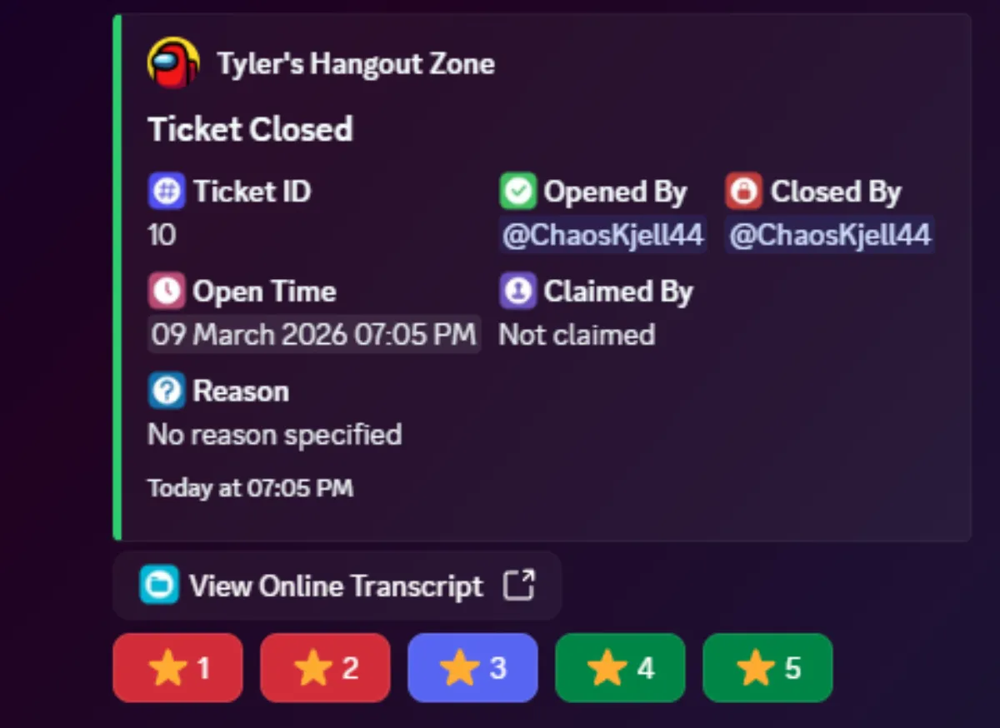
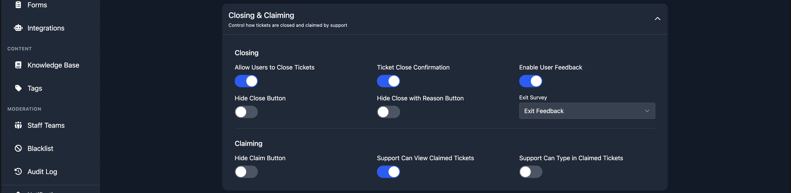

# User Feedback

User feedback lets your users rate the support they received after a ticket is closed. When enabled, the user is prompted with a star rating (1 to 5) after their ticket closes.

## Enabling Feedback

User feedback is enabled per panel. Open any panel from the [Panels](/dashboard/ticket-panels) page, expand the **Closing and Claiming** section, and enable the **Enable User Feedback** toggle.

The next time a user's ticket is closed on that panel, they will be asked to provide a rating.

## Exit Survey

You can collect more detailed feedback by attaching an exit survey form. When an exit survey is configured, the user is asked to fill in a form after leaving their star rating.

[Learn more about exit surveys](./exit-survey).

## Viewing Feedback

### Analytics

Premium subscribers can view feedback data on the [Analytics](/dashboard/analytics) page:

- **Avg Rating** shows the average star rating across all rated tickets.
- **Feedback Rate** shows the percentage of closed tickets that received a rating.
- **Feedback Distribution** shows a breakdown of how many ratings were given for each star value.

Individual staff member ratings are available on the [staff detail page](/dashboard/analytics#staff-detail-page).

### Transcripts

You can view the rating for any individual ticket on the [Transcripts](/dashboard/transcripts) page. The **Rating** column shows the star rating left by the user, or "No rating" if no feedback was submitted.

### Placeholders

You can include feedback statistics in your welcome messages using these [placeholders](/miscellaneous/placeholders):

- `%average_rating%` displays your server's average feedback rating.
- `%rating_count%` displays the total number of feedback ratings received.
