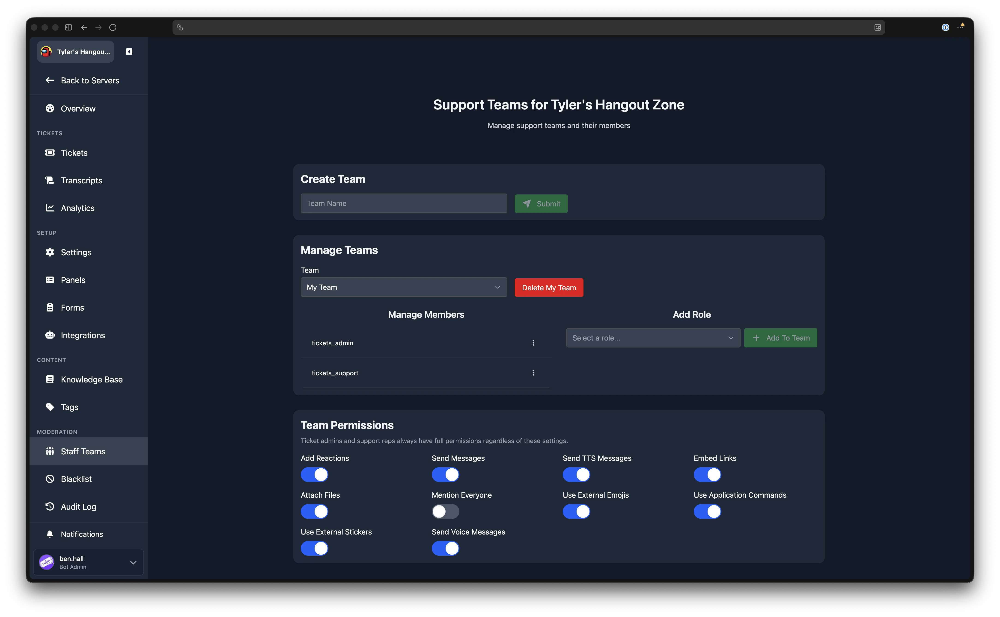

# Staff Teams

---

Staff teams can be used to further customize, which of your staff members can see, claim, respond to, and close specific types of tickets. This is possible because staff teams get linked to individual ticket panels however you see fit. Learn more about [ticket panels](./ticket-panels) and the [support teams input](./ticket-panels#support-teams).

## Teams Page

Navigate to **Dashboard** > your server > **Staff Teams** (in the Moderation sidebar group).

The page has three sections: **Create Team**, **Manage Teams**, and **Team Permissions** (visible when a non-default team is selected).

## Create Team

Enter a team name in the text field and click **Submit** to create a new team. The team appears in the team selector dropdown immediately.

## Manage Teams

### Selecting a Team

Use the **Team** dropdown to switch between teams. The page loads the selected team's members and permissions.

### Deleting a Team

Select a team and click the **Delete** button next to the dropdown. A confirmation dialog appears. If a deleted team was linked to a ticket panel, that panel will no longer have a team assigned, and all staff members will be able to see and manage tickets for that panel.

:::warning Default Team Cannot Be Deleted
The Default team cannot be deleted. See [Default Team](#default-team) below.
:::

### Adding Roles to a Team

The right-hand column, labelled **Add Role**, contains a role selector dropdown listing all roles in your Discord server. Select a role and click **Add To Team** to assign that role to the current team. Members with that role will then have access to tickets routed to this team.

:::info Users and Roles as Members
The dashboard supports both individual users and roles as team members. Existing user members added through Discord commands are shown in the members list. New members are added via roles using the dashboard interface.
:::

### Removing Members

The left-hand column, labelled **Manage Members**, lists all current members and roles assigned to the selected team. Open the action menu for any member or role and click **Remove**. A confirmation dialog appears before the member is removed.

## Team Permissions

When a non-default team is selected, a **Team Permissions** section appears below the member management area. These permissions control what team members can do inside ticket channels. Each permission can be toggled on or off individually, and changes are saved automatically.

The available permissions are:

| Permission | Default |
| ---------- | ------- |
| Add Reactions | On |
| Send Messages | On |
| Send TTS Messages | On |
| Embed Links | On |
| Attach Files | On |
| Mention Everyone | Off |
| Use External Emojis | On |
| Use Application Commands | On |
| Use External Stickers | On |
| Send Voice Messages | On |

:::info Admins Bypass These Settings
Ticket admins and support reps always have full permissions regardless of these settings.
:::

Team permissions are not available for the Default team.

## Default Team

The Default team is created automatically and cannot be deleted. Members and roles added through the `/addadmin` and `/addsupport` commands are placed into this team.

:::tip Related Commands
Learn more about the [/addadmin and /addsupport](/commands/add-admin-support) commands.
:::

## Linking Teams to Panels

To restrict a ticket panel to a specific team, edit the panel on the [Ticket Panels](/dashboard/ticket-panels) page and select the team in the routing section. Only members of the assigned team will be able to see and respond to tickets created through that panel.
