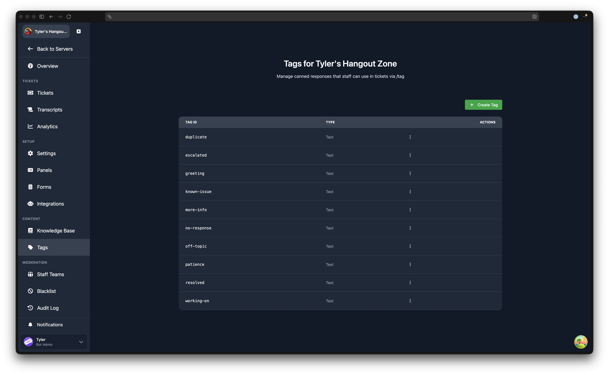
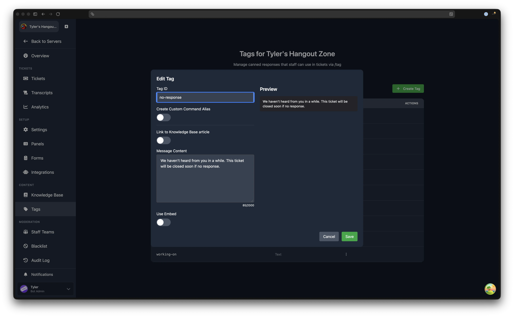

# Tags

---

Tags are pre-defined snippets of text sent by the bot. These can be useful for quickly sending responses to commonly asked questions or concerns.

## Tags List

Navigate to **Dashboard** > your server > **Tags** (in the Content sidebar group).

The main page shows a table with two columns:

- **Tag ID**: the identifier used in the `/tag` command (displayed in monospace)
- **Type**: shows whether the tag is Text, Embed, or Embed + Text

Each row has an action menu with the following options:

- **Edit** opens the tag editor modal with the tag's current settings
- **Clone** opens the tag editor pre-filled with all of the original tag's settings (see [Cloning a Tag](#cloning-a-tag))
- **Publish to Gallery** submits the tag to the public gallery for other servers to import
- **Remove** deletes the tag after a confirmation prompt

Click **Create Tag** to open the tag editor for a new tag.

## Creating a Tag

Click **Create Tag** to open the tag editor modal. The modal title reads "Create Tag" for new tags, "Edit Tag" when editing, and "Clone Tag" when cloning.

### Tag ID

The Tag ID is the name used in the `/tag` command. For example, if the ID is `greeting`, staff would type `/tag greeting` in Discord.

Tag IDs must be 1 to 16 characters, lowercase, and can only contain letters, numbers, hyphens, and underscores. The editor automatically converts your input to lowercase and strips invalid characters.

### Create Custom Command Alias

When enabled, this creates a dedicated slash command for the tag (e.g. `/greeting` instead of `/tag greeting`). This is a Premium feature. If your server does not have Premium, the toggle is disabled with a "(Premium)" label.

### Message Content

The text message the bot sends when the tag is used. Maximum 2,000 characters.

:::tip Placeholders Work in Tags
Tags support [placeholders](/miscellaneous/placeholders) when used in ticket channels. Every welcome message placeholder works in the message content, allowing you to create dynamic responses with user information, ticket details, and more. Inside an embed, which placeholders each field takes is listed under [where they work](/miscellaneous/placeholders#where-they-work).
:::

### Link to Knowledge Base Article

If your server has published [Knowledge Base](/dashboard/knowledge-base) articles, you can link a tag to an article instead of writing separate content. Toggle **Link to Knowledge Base article** and select an article from the dropdown.

When the tag is invoked in Discord, the linked article's content (including any embed) is displayed. The tag's own content and embed settings are kept as a fallback in case the article is later deleted or unpublished.

:::tip Edit Once, Update Everywhere
This is useful for keeping canned responses in sync with your knowledge base. Edit the article once, and all linked tags automatically use the updated content.
:::

### Use Embed

Toggle **Use Embed** to send the tag response as a Discord embed. When enabled, the following settings appear:

**Embed settings:**

- **Title**: bold text at the top of the embed (maximum 256 characters)
- **Colour**: the accent colour on the left side of the embed, chosen via a colour picker
- **Description**: the main body text of the embed (maximum 4,096 characters)

**Author section** (collapsible):

- **Author Name**: text displayed above the embed title
- **Author Icon URL**: image displayed to the left of the author name
- **Author URL**: makes the author name a clickable hyperlink

**Images section** (collapsible):

- **Thumbnail URL**: small image displayed at the top right of the embed
- **Image URL**: large image displayed at the bottom of the embed

**Footer section** (collapsible):

- **Footer Text**: smaller text at the very bottom of the embed
- **Footer Icon URL**: image displayed to the left of the footer text
- **Footer Timestamp**: optional date/time displayed after the footer text

**Embed Fields** (collapsible):

Additional titled sections within the embed. Each field has a **Name** (bold heading), **Value** (body text), and an **Inline** toggle. Inline fields display side by side on the same row; non-inline fields stack vertically.

A live preview of the embed is shown on the right side of the modal as you edit.

## Cloning a Tag

Open the action menu for any tag on the list page and click **Clone**. The tag editor opens with all settings copied from the original, including message content, embed configuration, and fields. Update the Tag ID (and any other details you wish to change) and save. The original tag is not modified.

## Deleting a Tag

Open the action menu for any tag and click **Remove**. A confirmation dialog appears. Deletion is permanent.

## Using a Tag in Discord

In Discord, type `/tag` followed by the tag ID. Autocomplete suggestions appear as you type, showing available tag IDs for the server.

## Publishing to Gallery

You can share your tag with other Tickets users by opening the action menu and clicking **Publish to Gallery**. Other server admins can then import your tag directly from the gallery.
