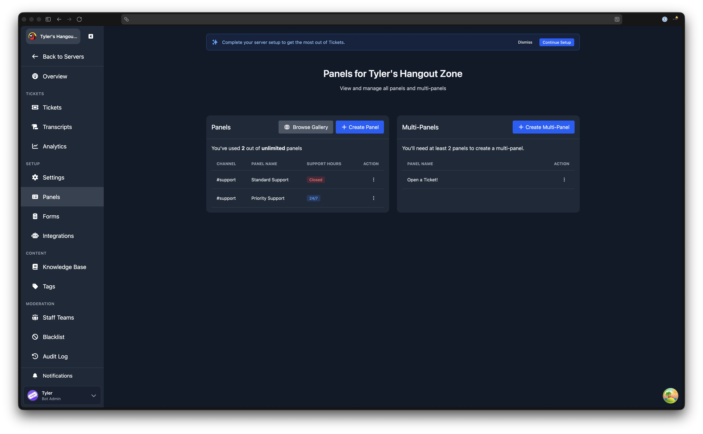
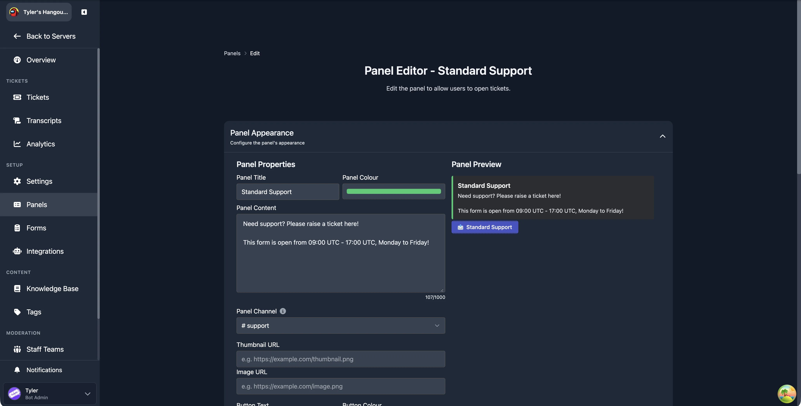
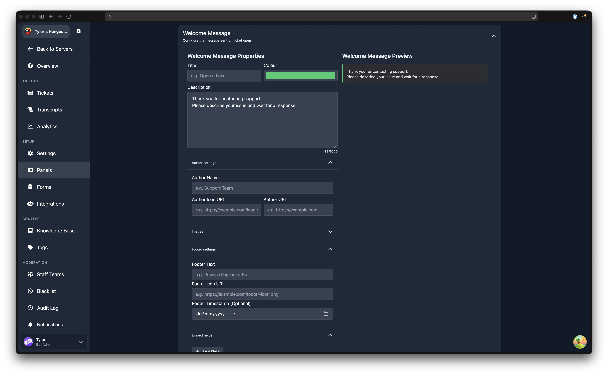
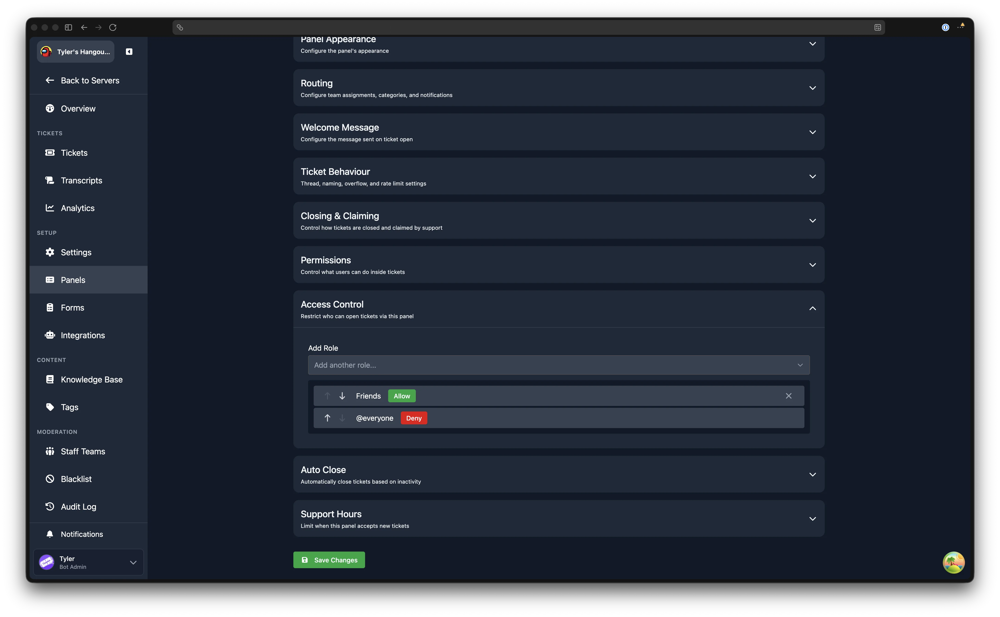

# Panels

---

Panels are the primary way users open tickets in your server. Each panel sends an embed with a button to a Discord channel; when a user clicks the button, a new ticket is created. You can create multiple panels with different settings, categories, and support teams to handle different types of requests.

## The Panels Page

The Panels page shows all of your server's panels and multi-panels side by side. To reach it, open the dashboard, select your server, and click **Panels** in the sidebar.

The left section lists your individual panels. Each row shows the channel, panel name, and support hours status (Open, Closed, or 24/7). The right section lists your [multi-panels](/dashboard/multi-panels).

Free servers are limited to **3 panels**. Premium servers can create unlimited panels. If you have reached the free limit, a prompt to upgrade is displayed at the top of the page.

### Creating a Panel

Click **Create Panel** to open the panel editor with default values. Fill in the sections described below, then click **Create Panel** at the bottom of the page.

### Editing a Panel

Click the action menu on any panel row and select **Edit** to open the panel editor with the panel's current settings. After making changes, click **Save Changes**.

### Deleting a Panel

Click the action menu and select **Remove**. A confirmation prompt will appear. If you delete the panel's message directly in Discord instead, the panel continues to exist on the dashboard and can be resent.

### Resending a Panel

If the panel message in Discord was deleted or you need to re-post it, click the action menu and select **Resend**. The bot sends a fresh copy of the panel embed to the configured channel.

### Cloning a Panel

Click the action menu and select **Clone** to open the panel creation page pre-filled with all of the original panel's settings, including ticket properties, the panel message, welcome message, access control rules, and support hours. Adjust any details you wish to change (such as the title or channel), then save.

:::info Free Plan Panel Limit
Free servers are limited to 3 panels. If cloning would exceed this limit, you will need to upgrade to premium. [Learn more about premium](https://tickets.bot/premium).
:::

### Publishing to the Template Gallery

Click the action menu and select **Publish to Gallery** to share your panel design with the community. See the [Template Gallery](/dashboard/panel-gallery) page for details on the submission process.

### Gallery Submissions

If you have published any panels, tags, or forms to the gallery, a **Gallery Submissions** section appears below the panels and multi-panels lists. Each submission shows its name, category, status (Pending, Approved, or Rejected), import count, and actions to edit or withdraw it.

## Panel Editor

The panel editor is used for both creating and editing panels. It is organised into the following collapsible sections, described in order below.

## Panel Appearance

Controls how the panel embed looks in Discord and which channel it is posted to.

### Classic vs Components v2

By default, the panel message uses the classic embed described below. You can instead switch it to **Components v2**, a block-based builder that replaces the fixed embed fields with a free-form set of blocks you assemble yourself. [Learn more about the Components v2 Builder](./settings/components-v2-builder).

:::tip Premium Feature
Components v2 requires [Premium](https://tickets.bot/premium). Free servers see the option locked with an upgrade prompt and keep using the classic embed builder.
:::

### Panel Title

The bold text at the top of the embed. Default: "Open a ticket".

### Panel Colour

The accent colour shown on the left edge of the embed. Click the colour picker to choose a custom colour.

### Panel Content

The main body text of the embed. Use this to describe your support process, available languages, or any other information for your users. Maximum length: 1,000 characters.

:::tip Formatting
You can use [Discord message formatting](https://discord.com/developers/docs/reference#message-formatting) in the panel content, including bold, italic, links, and mentions.
:::

### Panel Channel

The Discord text channel where the bot sends the panel embed. This should be a channel accessible to all members. In thread mode, new tickets are created as threads under this channel. In channel mode, tickets open in the ticket category, but the panel message still lives in this channel.

:::warning Use a Separate Channel
Do not use the same channel as your transcript channel.
:::

### Thumbnail URL

A URL pointing to an image displayed as a small thumbnail to the right of the embed content.

### Image URL

A URL pointing to an image displayed full-width below the embed content.

:::tip Image URLs
The URL should point directly to an image file. An easy way to get a suitable URL is to send the image as a message in a Discord channel, then right-click the image and choose **Copy Link**.
:::

### Button Text

The label displayed on the panel button. Default: "Open Ticket".

### Button Colour

The colour of the panel button. Options are Blue, Grey, Green, and Red.

### Button Emoji

The emoji displayed on the panel button. You can paste a standard Unicode emoji directly into the field. To use a custom emoji from your server, the picker shows a list of your server's custom emojis to choose from.

## Routing

Controls where tickets go, which teams handle them, and what notifications are sent when a ticket is opened.

### Support Teams

Select which staff teams handle tickets created from this panel. You can select the **Default** team, any custom teams you have created, or a combination. If no team is selected, all staff can see the ticket.

### Ticket Category

The Discord channel category that new ticket channels are created under. Each panel can use a different category, letting you organise tickets by type. [Learn more about channel categories](https://support.discord.com/hc/en-us/articles/115001580171-Channel-Categories-101).

### Awaiting Response Category

When a ticket is awaiting a response from the user, it can be automatically moved to a separate category to help staff prioritise. Select the category to use, or leave it empty to disable this behaviour.

[Learn more about the awaiting response category](./settings/awaiting-user-response).

:::tip Premium Feature
This is a premium feature. [Learn more about premium](https://tickets.bot/premium).
:::

### Transcript Channel

The text channel where the bot posts a summary message after a ticket is closed. The summary includes the ticket ID, opener, closer, timestamps, and a link to the online transcript (if transcripts are enabled). Leave empty to disable. Works together with the **Enable Transcripts** toggle below.

### Mention On Open

A list of roles or users to mention when a ticket is opened from this panel. You can also select **Ticket Opener** to mention the user who opened the ticket, or **@here** to mention all online members in the ticket channel.

:::warning Muted Users Are Not Notified
Mentions will not notify users who have their notification settings set to mute.
:::

### Mentions Behaviour

Controls what happens to the mention message after it is sent:

| Option | Behaviour |
|---|---|
| Delete mentions | The mention message is deleted after sending |
| Hide Mentions | The mention message is hidden (suppressed) |
| Do Nothing | The mention message remains visible |

### Form

Attach a form to this panel. When a user clicks the panel button, they are presented with the form to fill in before the ticket is created. Select "None" to open tickets without a form.

[Learn more about forms](./forms).

### Enable Transcripts

Toggle whether transcripts of tickets opened from this panel are stored for later review by staff.

## Welcome Message

The welcome message is the embed sent to the ticket channel as soon as the ticket is opened. The editor includes a live preview on the right side.

Previously, the welcome message was set globally on the Settings page. It is now configured per panel.

### Classic vs Components v2

The welcome message can also be switched from the classic embed to **Components v2**, the same block-based builder available for the panel message. [Learn more about the Components v2 Builder](./settings/components-v2-builder).

:::tip Premium Feature
Components v2 requires [Premium](https://tickets.bot/premium). Free servers see the option locked with an upgrade prompt and keep using the classic embed builder.
:::

### Title

The bold text at the top of the welcome message embed.

### Title URL

Makes the title a clickable link.

### Colour

The accent colour on the left edge of the welcome message embed.

### Description

The main body text of the welcome message. Maximum length: 1,000 characters. [Placeholders](../miscellaneous/placeholders) can be used here.

:::tip Formatting
You can use [Discord message formatting](https://discord.com/developers/docs/reference#message-formatting) in the description, including bold, italic, channel links, role mentions, and user mentions. To use mentions, enable Discord Developer Mode (User Settings, Advanced, Developer Mode), right-click any channel, user, or role and choose **Copy ID**, then use the format from [Discord's formatting reference](https://discord.com/developers/docs/reference#message-formatting).
:::

### Author Settings

An expandable sub-section with fields for:

- **Author Name** - text displayed above the embed title.
- **Author Icon URL** - a small image displayed next to the author name.
- **Author URL** - a link that the author name points to when clicked.

### Images

An expandable sub-section with fields for:

- **Thumbnail URL** - a small image shown to the right of the embed content.
- **Image URL** - a large image shown below the embed content.

### Footer Settings

An expandable sub-section with fields for:

- **Footer Text** - text displayed at the bottom of the embed.
- **Footer Icon URL** - a small image displayed next to the footer text.
- **Footer Timestamp (Optional)** - a date and time displayed next to the footer.

### Embed Fields

An expandable sub-section where you can add custom fields to the embed. Each field has a name, value, and an option to display it inline.

## Ticket Behaviour

Controls how tickets are created, named, and limited.

Previously, several of these settings were on the global Settings page. They are now configured per panel.

### Create Tickets as Threads

When enabled, tickets are created as private threads instead of separate channels. Click the info icon next to the toggle for a detailed comparison of thread mode and channel mode.

[Learn more about thread mode](./settings/thread-mode).

### Thread Notification Channel

Only available when thread mode is enabled. Select the text channel where the bot posts a notification embed each time a ticket thread is opened. Staff can click a button on that embed to join the thread. This field is required when thread mode is active.

### Naming Scheme

Choose how ticket channels (or threads) are named. Preset options:

- `ticket-%id%` (default)
- `ticket-%username%`
- `ticket-%id%-%username%`
- `ticket-%nickname%`
- `ticket-%id_padded%`
- **Custom** - enter your own pattern.

When **Custom** is selected, a text field appears for you to type a custom naming scheme. Spaces are automatically replaced with hyphens. [Placeholders](../miscellaneous/placeholders#custom-naming-scheme-placeholders) can be used.

### Show in /open Command

When enabled, this panel appears as an option in the `/open` command, letting users open a ticket from the command picker instead of clicking a button. When disabled, the panel is only accessible via its button in the panel channel.

### Enable Overflow Category

Discord limits each category to 50 channels. When enabled, tickets that would exceed this limit are created in the overflow category instead.

### Overflow Category

Only visible when overflow is enabled. Select the Discord channel category to use when the primary ticket category is full.

### Ticket Open Cooldown (seconds)

A per-user cooldown preventing users from opening tickets on this panel in rapid succession. Set to 0 to disable (default). Staff members are exempt from cooldowns. On the edit page, a **Reset Cooldowns** button clears all active cooldowns for the panel.

### Max Open Tickets Per User

The maximum number of tickets a single user can have open at the same time on this panel. Set to 0 for no limit (default). Maximum value: 10. Staff members are exempt from this limit.

## Closing and Claiming

Controls how tickets are closed and how staff claim tickets. The section is divided into **Closing** and **Claiming** sub-headings.

Previously, several of these settings were on the global Settings page. They are now configured per panel.

### Closing

#### Allow Users to Close Tickets

Toggle whether the user who opened the ticket can also close it. When disabled, only staff members can close tickets.

#### Ticket Close Confirmation

Toggle whether a second confirmation prompt is required before a ticket is closed.

#### Enable User Feedback

Toggle whether users are asked to provide a star rating after their ticket is closed.

[Learn more about user feedback](./settings/user-feedback).

#### Hide Close Button

Toggle whether the **Close** button is hidden in tickets opened from this panel.

#### Hide Close with Reason Button

Toggle whether the **Close with Reason** button is hidden in tickets opened from this panel.

#### Exit Survey

Select a form to present to users when their ticket is closed, allowing them to provide structured feedback. Select "None" to disable. The form must already exist on the [Forms](/dashboard/forms) page.

[Learn more about exit surveys](./settings/exit-survey).

:::tip Premium Feature
This is a premium feature. [Learn more about premium](https://tickets.bot/premium).
:::

### Claiming

[Learn more about claiming tickets](./settings/claiming-tickets).

#### Hide Claim Button

Toggle whether the **Claim** button is shown in tickets opened from this panel.

#### Support Can View Claimed Tickets

Toggle whether other support staff can view a ticket that has been claimed by a different staff member.

#### Support Can Type in Claimed Tickets

Toggle whether other support staff can send messages in a claimed ticket. This option is only available when **Support Can View Claimed Tickets** is enabled.

## Permissions

Controls which Discord permissions are granted to the ticket opener inside their ticket channel. Each permission has a toggle:

- **Enabled (green)** - the user receives this permission in the ticket channel.
- **Disabled (grey)** - the user does not receive this permission.

Previously, these settings were on the global Settings page. They are now configured per panel.

The available permissions are:

| Permission | Description |
|---|---|
| Add Reactions | Allow the user to add reactions to messages |
| Send TTS Messages | Allow the user to send text-to-speech messages |
| Embed Links | Allow URLs posted by the user to show embeds |
| Attach Files | Allow the user to upload files |
| Use External Emojis | Allow the user to use emojis from other servers |
| Use External Stickers | Allow the user to use stickers from other servers |
| Send Voice Messages | Allow the user to send voice messages |

## Access Control

Restrict which roles can open tickets from this panel. The access control list is evaluated from top to bottom, stopping at the first matching rule.

Each rule specifies a role and an action: **Allow** or **Deny**. By default, the server's @everyone role is set to Allow, meaning all members can open tickets. Add Deny rules above it to block specific roles, or change the default to Deny and add Allow rules for specific roles.

## Auto Close

Automatically close tickets based on inactivity. All options in this section require the **Enable Auto Close** toggle to be active.

:::tip Premium Feature
This is a premium feature. [Learn more about premium](https://tickets.bot/premium).
:::

### Enable Auto Close

Master toggle for auto-close behaviour on this panel.

### Close on User Leave

When enabled, tickets are automatically closed if the user who opened the ticket leaves the server.

### Since Open with No Response

Set a duration. If the ticket opener does not send a message within this time after the ticket is opened, the ticket is closed automatically.

### Since Last Message

Set a duration. If no messages are sent in the ticket for this length of time, the ticket is closed automatically.

## Support Hours

Restrict when this panel accepts new tickets. Support hours are configured per day of the week with a start and end time in a timezone of your choice. Outside of the configured hours, the panel button is disabled and users cannot open tickets.

[Learn more about support hours](../features/support-hours).

:::info Free Plan Support Hours Limit
Free servers can configure support hours on 1 panel. Premium servers have no limit. [Learn more about premium](https://tickets.bot/premium).
:::
