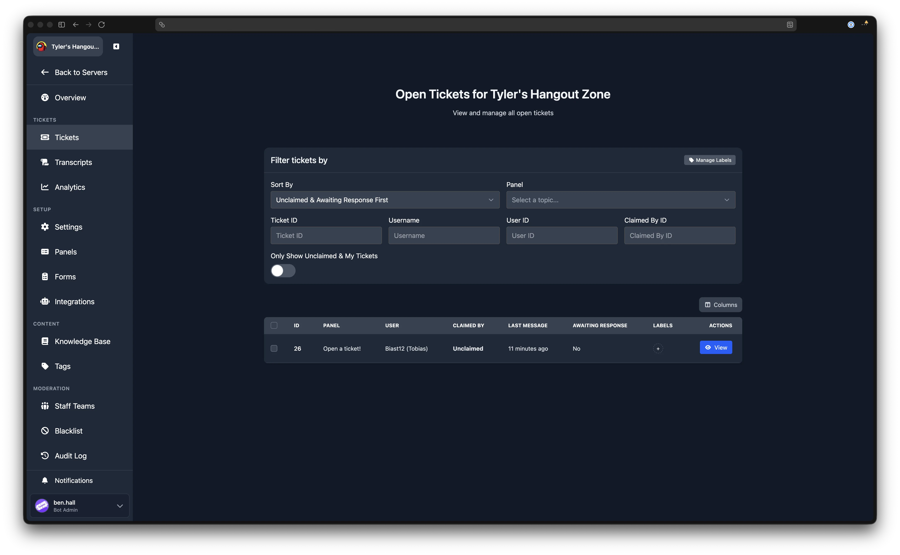
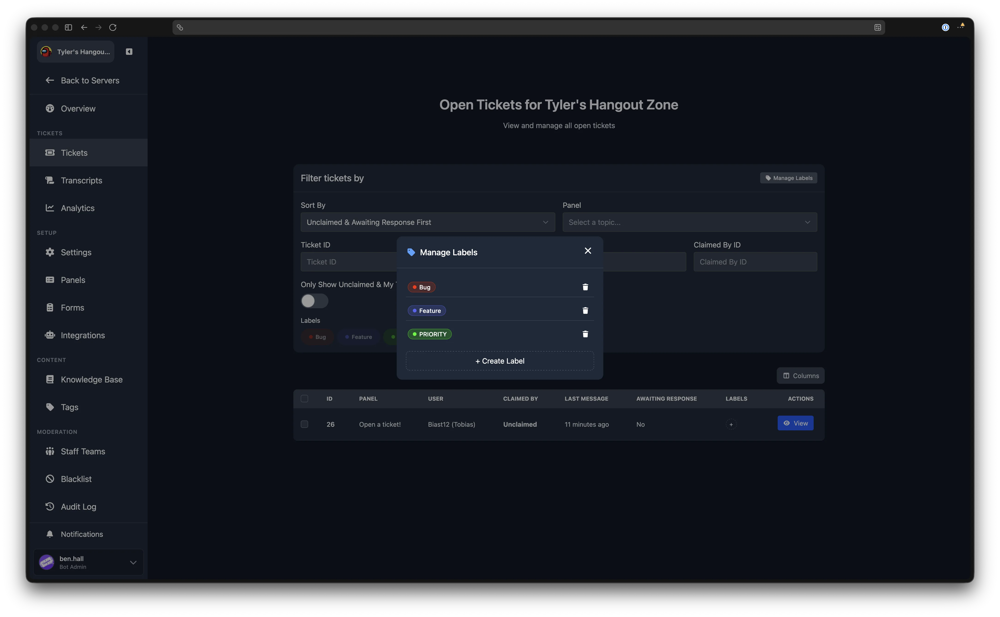
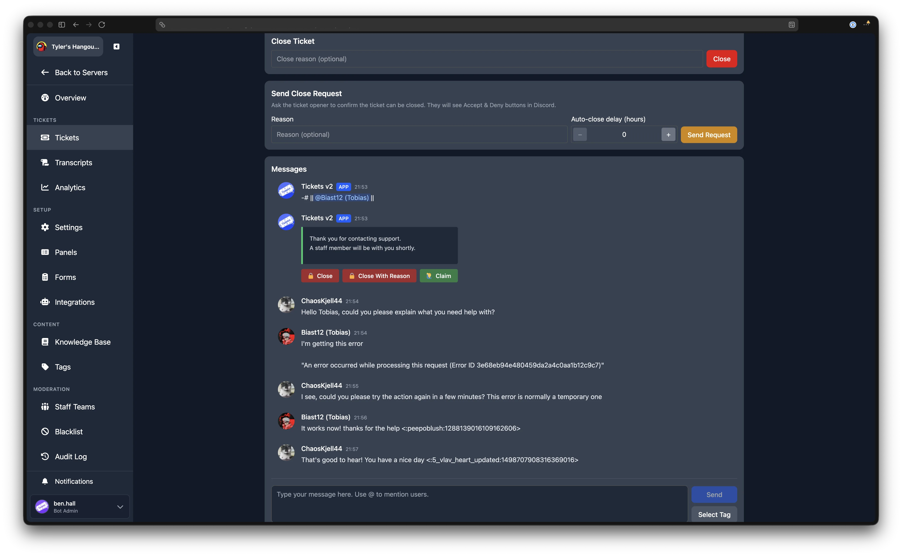
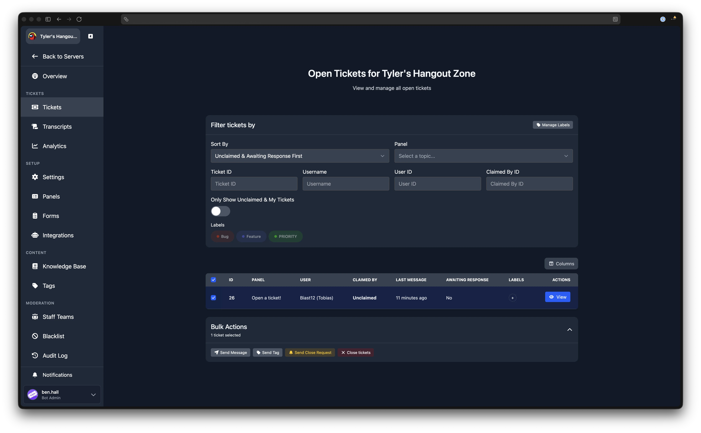

# Tickets

The Tickets page shows all currently open tickets in your server. From here you can filter, sort, label, and take bulk actions on tickets, or click through to view an individual ticket's messages.

## Filtering and Sorting

The filter card at the top of the page provides several controls for narrowing down the ticket list. Filters are applied automatically as you type.

### Sort By

A dropdown that controls the order of the ticket list. The options are:

| Sort | Behaviour |
|------|-----------|
| **Unclaimed & Awaiting Response First** | Tickets that are unclaimed or claimed by you appear first. Among those, tickets awaiting a user response are prioritised. This is the default. |
| **Ticket ID (Ascending) / Oldest First** | Sorts by ticket number from lowest to highest. |
| **Ticket ID (Descending) / Newest First** | Sorts by ticket number from highest to lowest. |

### Panel

Filter tickets by the [ticket panel](./ticket-panels) they were created from. Select a panel name, or choose "Any Panel" to show all tickets.

### Text Filters

The following text fields filter tickets by specific criteria. The Ticket ID, Username, and User ID filters are mutually exclusive: entering a value in one clears the others.

| Filter | Description |
|--------|-------------|
| **Ticket ID** | Show only the ticket with this ID number. |
| **Username** | Search by the ticket opener's Discord username. |
| **User ID** | Search by the ticket opener's Discord user ID. |
| **Claimed By ID** | Show only tickets claimed by this staff member's Discord user ID. |

### Only Show Unclaimed & My Tickets

A toggle that, when enabled, hides tickets that are claimed by other staff members. Only unclaimed tickets and tickets claimed by you are shown.

### Table Columns

You can customise which columns appear in the ticket table using the column selector button above the table. The available columns are:

| Column | Description |
|--------|-------------|
| **ID** | The ticket's unique number. |
| **Panel** | The panel the ticket was created from. |
| **User** | The Discord username of the ticket opener. |
| **Opened** | How long ago the ticket was opened (e.g. "2 hours ago"). |
| **Claimed By** | The staff member who claimed the ticket, or "Unclaimed". |
| **Last Message** | How long ago the most recent message was sent. |
| **Awaiting Response** | Whether the last message in the ticket was from the user (i.e. staff have not yet replied). |
| **Labels** | Any labels assigned to the ticket. |

## Labels

Labels are coloured tags you can assign to tickets to help organise and categorise them. Labels are shared between the Tickets and [Transcripts](./transcripts) pages, so any label you create here is also available on transcripts.

### Filtering by Label

If you have created labels, they appear as pill buttons below the filter fields. Click a label to toggle it as a filter. When one or more labels are active, only tickets with at least one of those labels are shown.

### Assigning Labels to a Ticket

In the **Labels** column of the ticket table, click the **+** button next to a ticket's existing labels. A dropdown appears listing all available labels. Click a label to assign or remove it. Changes are saved immediately.

### Managing Labels

::: tip Admin Only
The "Manage Labels" button is visible only to server administrators.
:::

Click **Manage Labels** in the filter card header to open the label management modal. From here you can:

- View all existing labels
- Delete a label by clicking the bin icon next to it
- Create a new label by clicking **+ Create Label**, entering a **Label Name**, choosing a **Colour**, and clicking **Create**

## Viewing a Ticket

Click the **View** button on any ticket row to open the ticket detail page.

### Ticket Info

A collapsible section at the top shows the ticket's metadata:

| Field | Description |
|-------|-------------|
| **ID** | The ticket number. |
| **Panel** | The panel the ticket was created from. |
| **Opened** | The date and time the ticket was opened. |
| **Opener** | The Discord username and user ID of the person who opened the ticket. |
| **Claimed by** | The staff member who claimed the ticket, or "Unclaimed". |

### Close Ticket

You can close the ticket by entering an optional close reason and clicking **Close**. After closing, you are returned to the tickets list.

### Send Close Request

Instead of closing the ticket immediately, you can send a close request to the ticket opener. They will see Accept and Deny buttons in Discord. You can optionally provide a reason and an **Auto-close delay (hours)** value. If the user does not respond within the specified number of hours, the ticket closes automatically.

### Messages

The ticket's messages are displayed below, rendered in the same style as Discord. Messages refresh automatically.

::: tip Premium Feature
Replying to tickets from the dashboard and live message updates via WebSocket require [Premium](../premium/introduction). Without Premium, messages refresh on a polling interval.
:::

If your server has Premium, a text input appears below the messages. Type your reply and click **Send** to post a message to the ticket channel in Discord. You can also use the **Select Tag** button to send a pre-made [tag](./tags) response.

## Bulk Actions

To perform actions on multiple tickets at once, select tickets using the checkboxes in the leftmost column of the table. You can also use the checkbox in the header row to select or deselect all visible tickets.

Once you have selected one or more tickets, a **Bulk Actions** section appears below the table. Expand it to see the available actions:

| Action | Description |
|--------|-------------|
| **Send Message** | Send the same message to all selected tickets. Enter the message text (up to 2000 characters) and click **Send**. |
| **Send Tag** | Send a [tag](./tags) to all selected tickets. Choose a tag from the dropdown and click **Send**. This option only appears if you have tags configured. |
| **Send Close Request** | Send a close request to all selected tickets. You can optionally enter a reason and an auto-close delay in hours. |
| **Close tickets** | Close all selected tickets immediately. You can optionally enter a close reason. |

