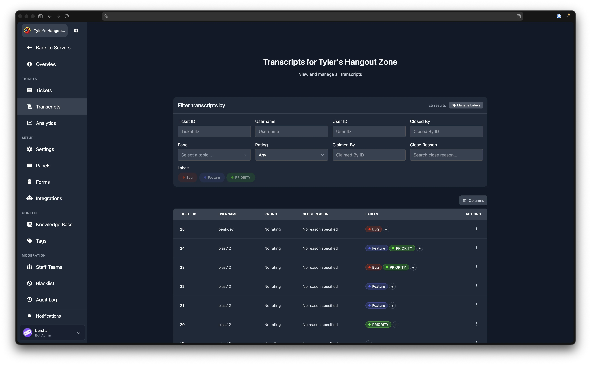
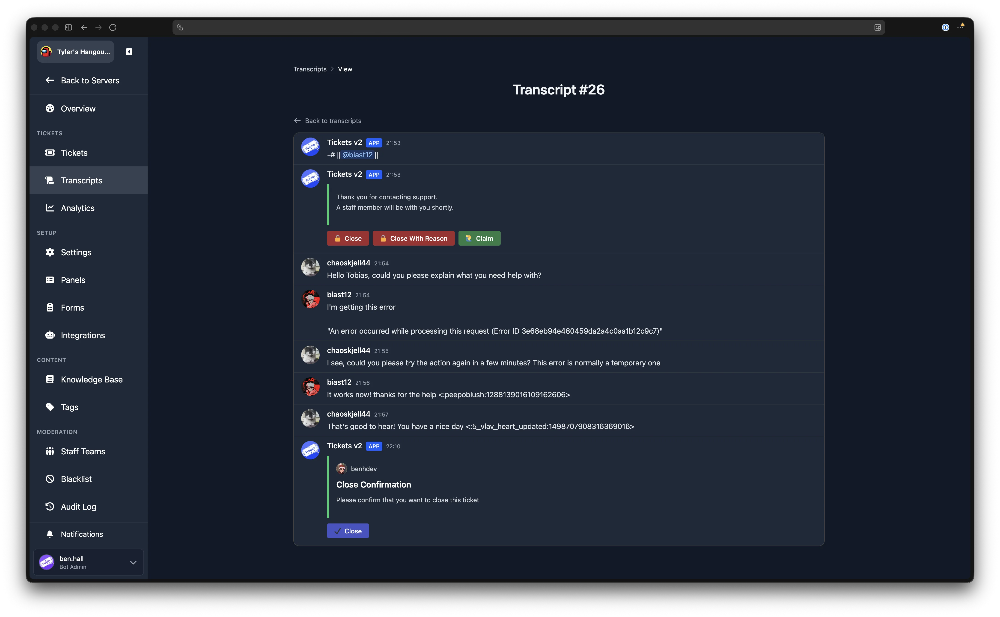

# Transcripts

The Transcripts page lists all closed tickets in your server. You can search and filter the list, assign labels, edit close reasons, and open a full message transcript for any ticket that has one stored.

## Filters

The filter card at the top of the page lets you narrow down the transcript list. All filters are applied together and update the results automatically as you type or select values. The total number of matching results is displayed in the filter header.

| Filter | Description |
|--------|-------------|
| **Ticket ID** | Show only the transcript for this ticket number. |
| **Username** | Search by the ticket opener's Discord username. |
| **User ID** | Search by the ticket opener's Discord user ID. |
| **Closed By** | Show only tickets closed by this user's Discord ID. |
| **Panel** | Filter by the [ticket panel](./ticket-panels) the ticket was created from. Select a panel name, or choose "Any Panel" to show all. |
| **Rating** | Filter by the star rating (1 through 5) given by the ticket opener in [user feedback](./settings/user-feedback). Select "Any" to show all. |
| **Claimed By** | Show only tickets claimed by this staff member's Discord user ID. |
| **Close Reason** | Search by text within the close reason. |

## Labels

Labels work the same way on the Transcripts page as on the [Tickets](./tickets#labels) page. The same set of labels is shared between both pages, so any label you create or delete in one place is reflected in the other.

### Filtering by Label

If labels exist, they appear as pill buttons below the filter fields. Click a label to toggle it on or off as a filter. When one or more labels are active, only transcripts with at least one of those labels are shown.

### Assigning Labels

In the **Labels** column of the transcript table, click the **+** button next to a transcript's existing labels. A dropdown appears listing all available labels. Click a label to assign or remove it. Changes are saved immediately.

### Managing Labels

::: tip Admin Only
The "Manage Labels" button is visible only to server administrators.
:::

Click **Manage Labels** in the filter card header to open the label management modal. Here you can view, delete, and create labels using a **Label Name** and **Colour**. This is the same modal used on the [Tickets](./tickets#managing-labels) page.

## Transcript Table

The table shows one row per closed ticket. You can show or hide columns using the column selector button above the table. The available columns are:

| Column | Description |
|--------|-------------|
| **Ticket ID** | The ticket's unique number. If a transcript is available, the ID is a clickable link to the [transcript view](#viewing-a-transcript). |
| **Username** | The Discord username of the ticket opener. |
| **Rating** | The star rating given by the ticket opener, or "No rating" if no feedback was left. |
| **Close Reason** | The reason provided when the ticket was closed, or "No reason specified". |
| **Labels** | Any labels assigned to the transcript. |

### Actions

Each row has an action menu with the following options:

- **View** opens the full transcript (only shown if a transcript is stored for that ticket).
- **Edit Close Reason** opens a modal where you can update or clear the close reason for that ticket.

## Viewing a Transcript

Clicking a ticket ID link or the **View** action opens the transcript viewer. This page renders the ticket's messages in the same style as Discord, including embeds, attachments, mentions, and components.

A **Back to transcripts** link at the top returns you to the transcript list.

## Pagination

Results are paginated. Use the page controls at the bottom of the table to navigate between pages.

## Who Can Access Transcripts

Any staff member with at least Support-level permissions on the server can view the Transcripts page and open individual transcripts. Creating, deleting, and managing labels requires Admin-level permissions.
