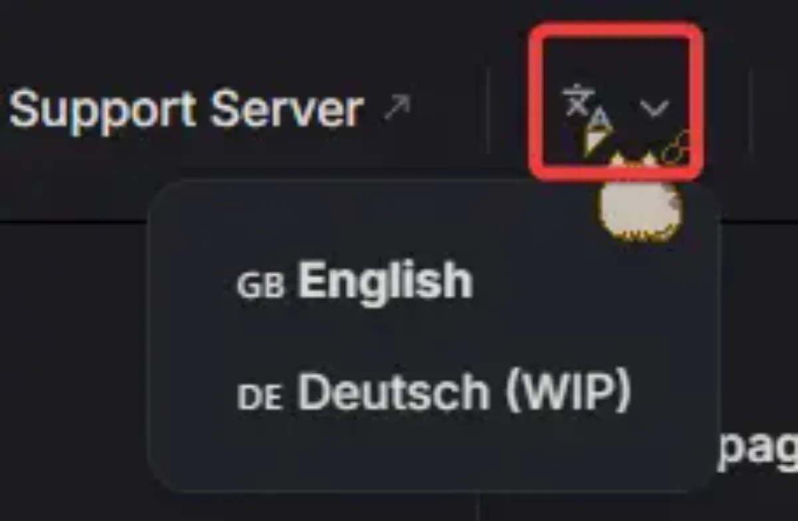

# Introduction

## Tickets Bot Official Documentation

Dive into the vast world of Tickets! This documentation aims to help you with:

* Easily setting up the bot
* Explaining each feature of the bot in detail
* Setting up each feature individually
* Correctly using the bot's commands
* Fixing issues with permissions and other common problems

<!--
## Available in Multiple Languages
Our documentation is available in multiple languages. To choose your preferred locale, click the language icon in the top-right corner.

-->

## This is a Living Document

Updates to the documentation are made frequently.

Maintained with <Icon icon="fa-solid fa-heart" /> by awesome people from the community!

:::tip Report Documentation Issues
If you find any issues in the documentation, things like typos and outdated information, then please let us know in our [support server](https://discord.gg/ticketsbot).
:::

Get started with setting up the bot by going to the [first chapter](../setup/introduction) of the documentation.
