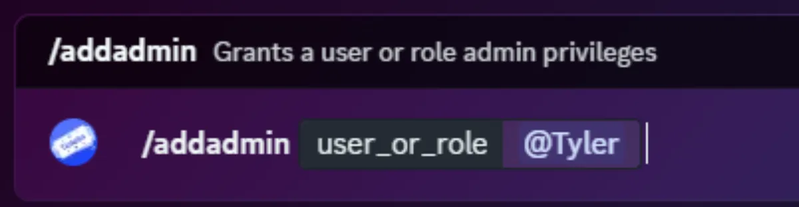

# Dashboard: No Permission

When the bot is first added to the server, you may receive a `No Permission` warning on the web dashboard when trying to manage it.

This is because Tickets uses its own permission management system, and ignores any permissions you may have in the Discord server itself.

In order to gain access to the web dashboard for your server, ask the **server owner** to add you as a bot admin using the `/addadmin @user` command. You can read more about the `/addadmin` command in [the command guide](../commands/add-admin-support).

