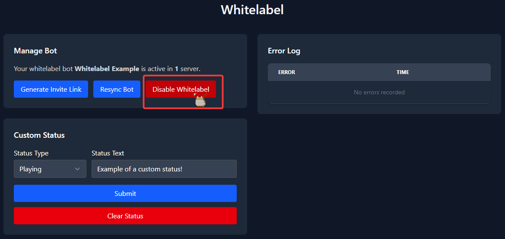
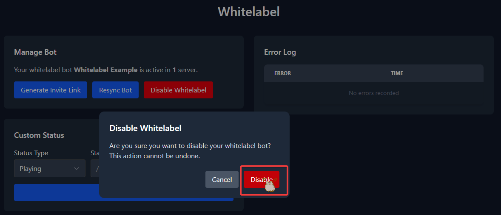

# Whitelabel Removal Guide

Please follow this guide **very carefully**. If you skip a single step, the process will not work. The whitelabel removal process is very short.

## (Step 1 of 4) Disable Whitelabel

Head over to the whitelabel section on the [web dashboard](https://dashboard.tickets.bot/whitelabel). There you will need to disable your whitelabel bot.

To do this press the `Disable Whitelabel` button.

Confirm by pressing `Disable` in the dialog that appears.

You will then be presented with a message saying that whitelabel has been disabled.

## (Step 2 of 4) Remove the Whitelabel Bot

Kick the whitelabel bot.

## (Step 3 of 4) Invite Tickets

Invite the Tickets bot to your server. Follow our [invite guide](../setup/invite) if you need help with this.

## (Step 4 of 4) Resend Your Ticket Panels

To do this you will need to delete the ticket panel messages sent by your whitelabel bot. Afterwards head to the [web dashboard](https://dashboard.tickets.bot) > select your server > `Ticket Panels` section > 3 dot menu > press the `Resend` button. Repeat this for **all ticket panels**.
