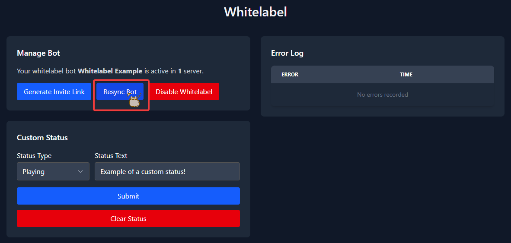
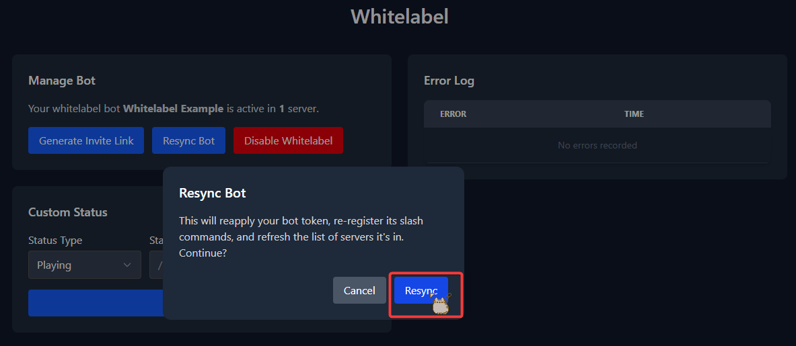

# Whitelabel Resync Guide

In some rare cases your whitelabel bot may become out of sync with our service. In that case you will need to resync it. The resync process is very short and easy.

Resync your bot if its slash commands are missing, if it appears offline, or if the server count shown under `Manage Bot` is wrong.

## (Step 1 of 1) Resync Your Bot

Head over to the whitelabel section on the [web dashboard](https://dashboard.tickets.bot/whitelabel). There you will need to press the `Resync Bot` button.

A confirmation dialog appears telling you exactly what will happen: it reapplies your bot token, re-registers its slash commands, and refreshes the list of servers your bot is in. Press `Resync` to continue.

Your bot is then reconnected and synced up with our systems again.

:::info Wait a Minute Between Resyncs
Slash commands may take a few minutes before they are visible. If you need to resync again, wait a full minute first — two resyncs in quick succession will skip the slash command refresh.
:::

:::info Privileged Intents May Be Required
If the resync fails with a message about privileged intents, Discord requires you to apply for them before your bot can use them. See the [Whitelabel Intents Guide](./whitelabel-intents-guide).
:::

## Optional: Resend Ticket Panels

In some cases you will need to resend your ticket panels. A resync does not do this for you.

To do this, head to the `Ticket Panels` tab of your server. Once there, click the three dots next to your ticket panel and choose the `Resend` option.

You will be presented with a message saying that your ticket panel has been sent successfully. If you receive an error, make sure that your whitelabel bot is active and added to your server.

Do this for **all of your ticket panels** that were sent by the whitelabel bot. Afterwards your bot and your ticket panels should be working again.
