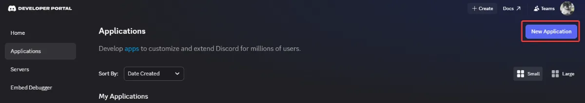
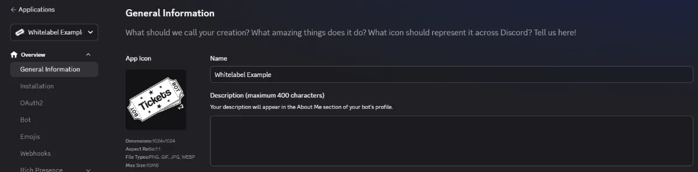
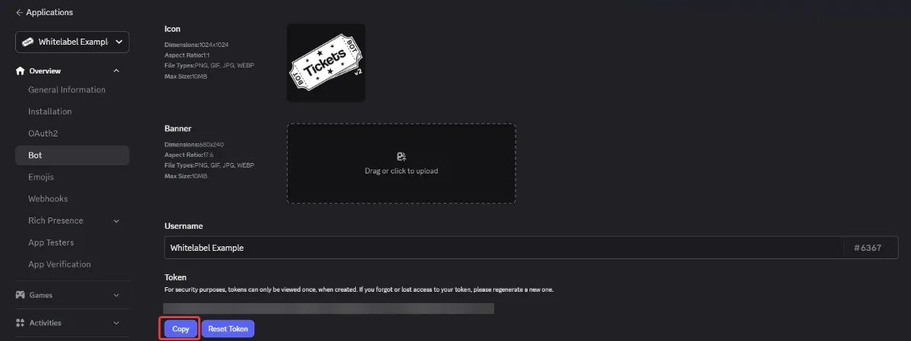
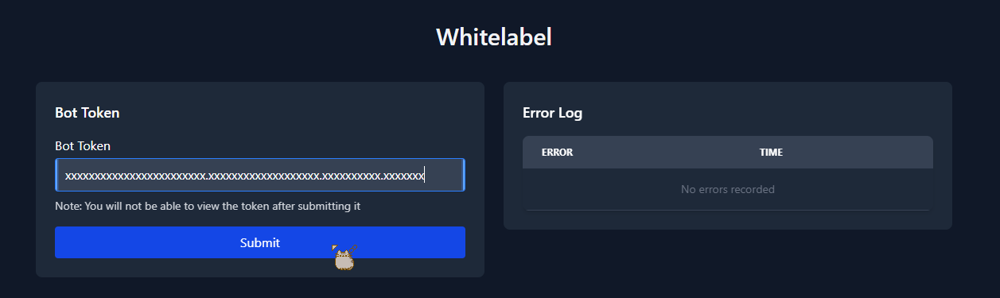
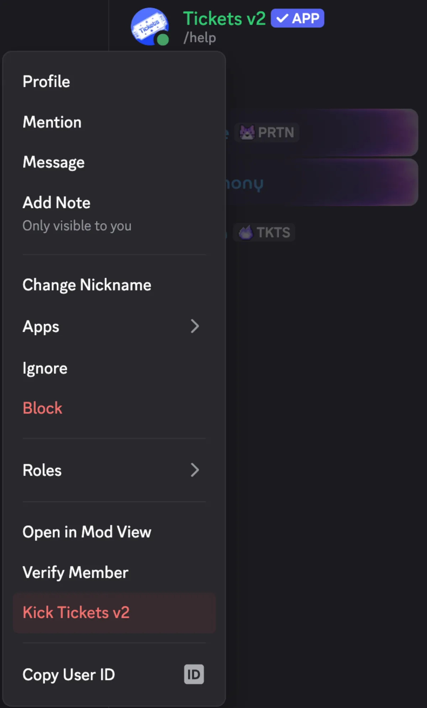
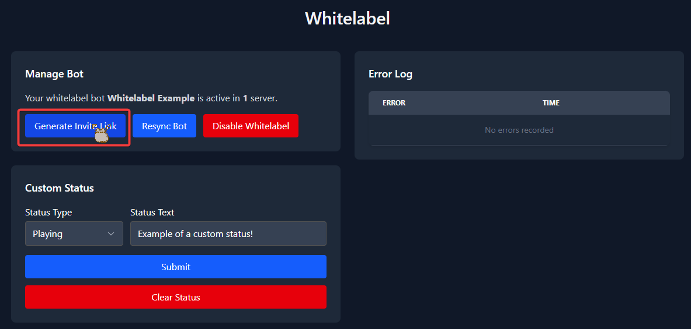
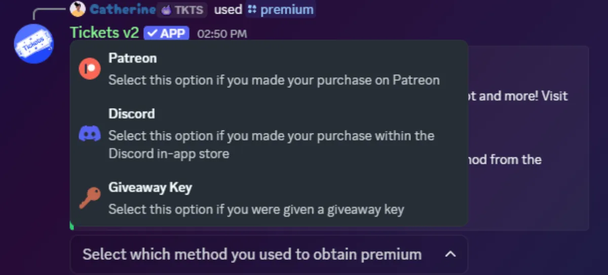
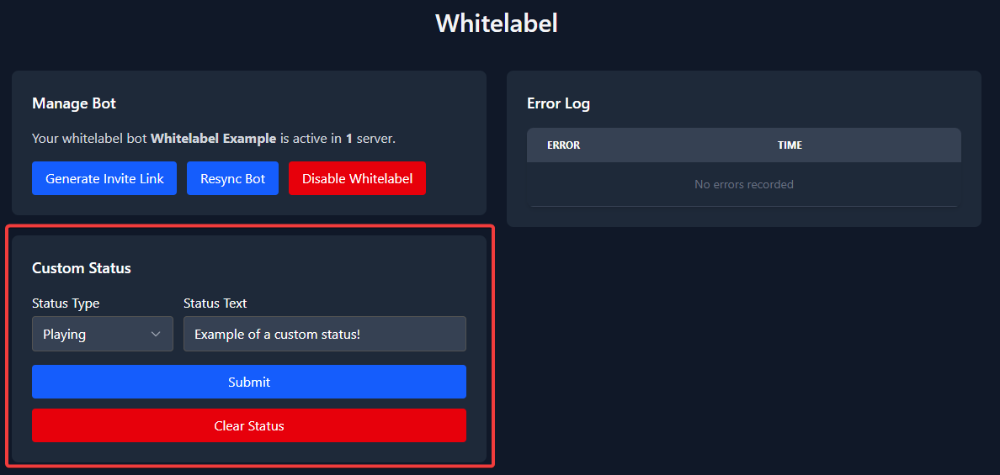
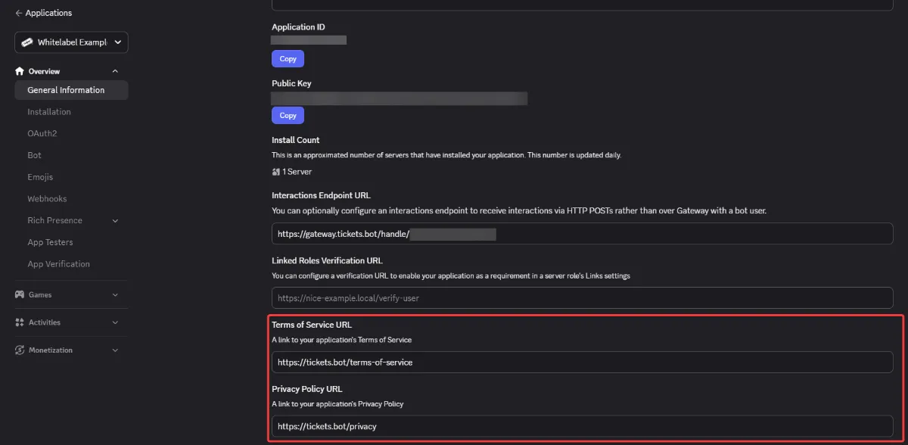

# Whitelabel Setup Guide

Thanks for purchasing whitelabel and supporting us!

Please follow this guide **very carefully**. If you skip a single step, the process will not work. The setup is short, and will only need to be done once.

## (Step 1 of 6) Link Patreon Account

If you haven't done so already, you'll need to link your Patreon and Discord accounts in [your Patreon settings](https://www.patreon.com/settings/apps).
Patreon has [a longer guide on how to do this](https://support.patreon.com/hc/en-us/articles/212052266-Get-my-Discord-role).

## (Step 2 of 6) Create Bot

Next, you'll need to create your custom bot that Tickets will run under. To do this, visit the [Discord developer portal](https://discord.com/developers/applications) and press `New Application` in the top right:

Enter a name for your bot and press create. From here, you can change your bot's avatar:

:::info Required Above 10,000 Users
Once your bot serves more than 10,000 users, Discord requires you to apply for privileged intents. See the [Whitelabel Intents Guide](./whitelabel-intents-guide).
:::

## (Step 3 of 6) Start Bot

Next, you have to submit the bot's token. This is like a password to the bot.

:::danger Keep Your Bot Token Secret
**Never send this token to anyone, not even in our support server.** If someone obtains this token, they have full control over your bot. If you believe your token has been compromised, immediately reset the token in the Discord developer portal and update the token on the Tickets web dashboard.
:::

Click on `Bot` on the sidebar of the Discord developer portal and copy the token. You may have to click the `Reset Token` button before you can copy the token:

Then head over to the whitelabel section on the [web dashboard](https://dashboard.tickets.bot/whitelabel). Paste the token into the `Bot Token` field and press `Submit`:

:::info Allow Up to 10 Minutes
There may be up to a 10 minute delay for the whitelabel section of web dashboard to recognize your status. Until it does, it will lead you back to the "buy premium/whitelabel" page.
:::

You will then be presented with a message saying that the bot is now online.

If you receive an error, make sure that you fully copied the token, not the client secret. Additionally, refresh the page and check the `Error Log` table for any errors.

## (Step 4 of 6) Invite Bot to Server

Before you can invite the bot to your server, you must kick the main Tickets bot from your server. It is **extremely** important that you do this **before** inviting your custom bot to your server.

:::danger Do Not Skip This Step
**If you skip this step, you risk losing your data.** If you are having issues with this step, please contact support immediately.
:::

To invite your whitelabel bot to your server, click the `Generate Invite Link` button under the `Manage Bot` section.

Upon clicking the button, you will be taken to the normal bot invite page - select your server and authorise. It is important that you grant the bot all the permissions that it asks for.

## (Step 5 of 6) Activate Premium Perks

The last mandatory step is to activate the premium perks that come with whitelabel for your server.

:::info Allow Up to 10 Minutes
There may be up to a 10 minute delay for the whitelabel bot to recognize the server and sync commands. Until it does, it will error when running commands. If the command errors, wait 10 minutes and try the command again.
:::

Go to your Discord server and run the `/premium` command. You must select the command when it displays to you after typing. Make sure to choose `Patreon` since that is how you paid for the whitelabel bot. **Giveaway Key is not used here.**

*If `Patreon` is not a selectable option, then your premium perks are already applied to the server.*

## (Step 6 of 6) Resend Your Ticket Panels

To do this you will need to delete the ticket panel messages sent by the Tickets bot. Afterwards head to our [web dashboard](https://dashboard.tickets.bot) > select your server > `Ticket Panels` section > 3 dot menu > press the `Resend` button. Repeat this for **all ticket panels**.

**And you're done!** Your bot should be ready for use.

There are a few more **optional** steps below, if you wish to take them.

## Optional: Set Custom Status

You can optionally change the status of your whitelabel bot. Simply enter the new status on the web dashboard and press `Submit`.

`Playing`, `Listening`, `Watching`, `Competing` and `Custom` are all currently available.

## Optional: Set Privacy Policy & Terms of Service Links

On the `General Information` tab of the Discord developer portal, you may have noticed `Terms Of Service URL` and `Privacy Policy URL` fields.

You should enter our policies here to inform users of how their data may be used.

**Terms of Service:** https://tickets.bot/terms-of-service
**Privacy Policy:** https://tickets.bot/privacy

