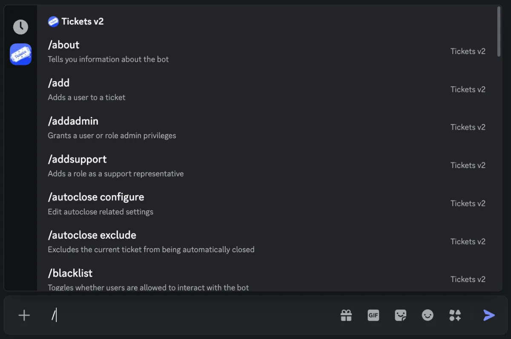

# Bot Configuration

Let's start getting the bot ready for use in your server!

Tickets was a very early adopter of slash commands, meaning that you can simply hit `/` in your Discord client to have commands auto-completed with the correct arguments:

If you're not the owner of the server, now would be a good time to get the owner to designate you as an admin of Tickets. You can do this by asking the owner to run the command `/addadmin @YourUsername` in a channel the bot can see. If successful, Tickets will show you a ✅.

There are two ways in which you can configure the bot:

- Via the [web dashboard](https://dashboard.tickets.bot) **[Recommended]**
- Via the `/setup` command in Discord

:::tip Use the Dashboard
We recommend using the web dashboard to configure the bot, as it's easier and more settings are available - including ticket panels.
:::

`/setup` automatically creates the roles, channels, and category you need (excluding ticket panels) without any interaction required from you. This is fine as a starting point, but every other setting - transcripts, thread mode, welcome messages, and so on - is configured per panel on the web dashboard. Ticket limits are set in two independent places that both apply: server-wide on the [Settings](/dashboard/settings/settings#simultaneous-ticket-limit) page, and per panel in the panel editor.

We have guides on both of the available methods:

- [Web dashboard](./dashboard) **[Recommended]**
- [Setup command](./setup-command)
