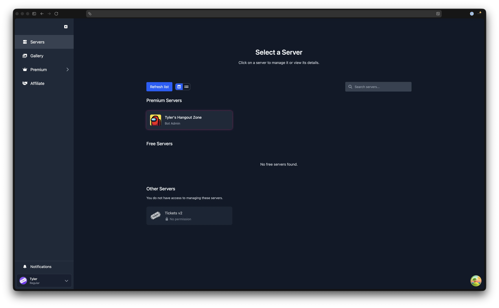

# Bot Configuration: Web Dashboard

The web dashboard is where you configure Tickets for your Discord server. This page walks you through logging in and selecting your server, then points you to the full dashboard guide.

## Logging In

Head to [dashboard.tickets.bot](https://dashboard.tickets.bot). You will be asked to log in with Discord. Click **Authorise** on Discord's OAuth2 page and you will be returned to the dashboard.

## Selecting Your Server

After logging in, you will see a list of servers. Servers where you have bot admin access (via `/addadmin` or server ownership) and where the bot has been invited appear under **Premium Servers** or **Free Servers**. Click a server to open its management dashboard.

If your server does not appear, check the following:

1. You are either the server owner or have been added as a Tickets bot admin using `/addadmin @YourUsername`
2. The Tickets bot has been invited to the server (see the [invite guide](./invite))
3. Try clicking **Refresh list** at the top of the server list, or log out and back in

## Exploring the Dashboard

For a complete tour of the dashboard layout, sidebar navigation, keyboard shortcuts, and command palette, see the [Dashboard Introduction](/dashboard/introduction).
