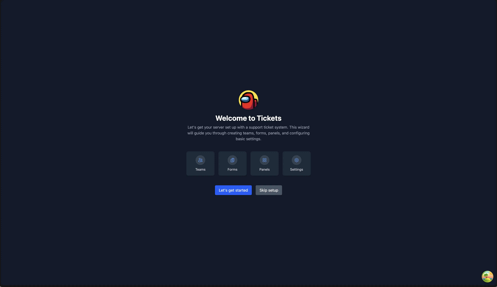
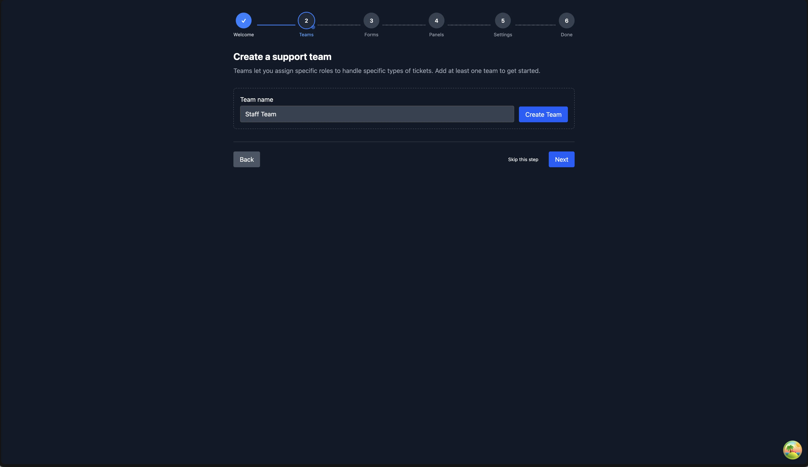
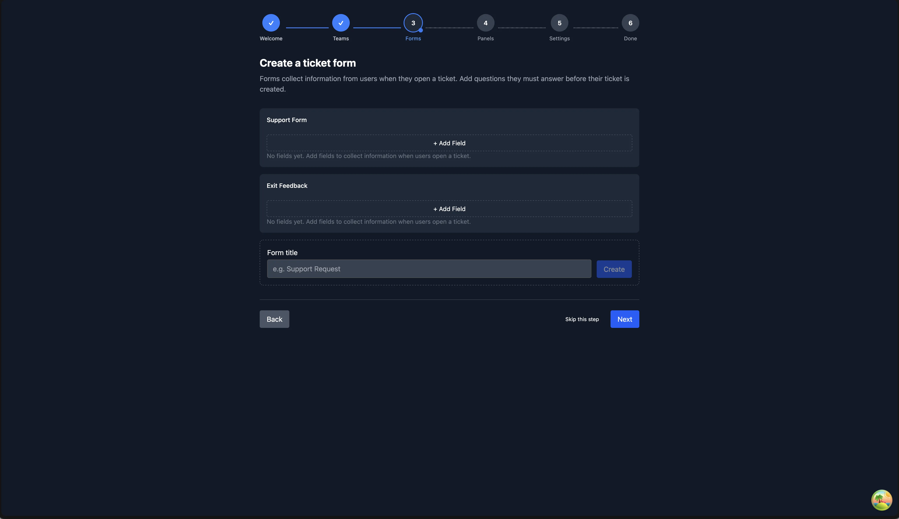
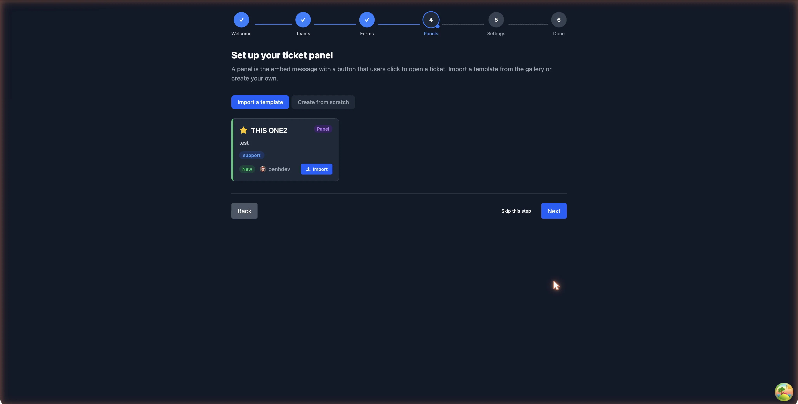
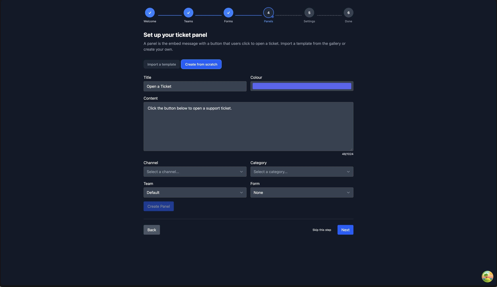
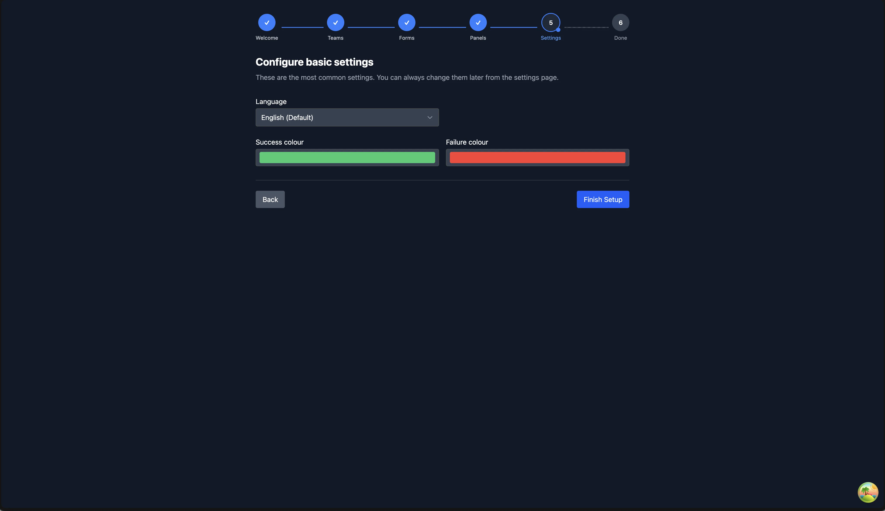
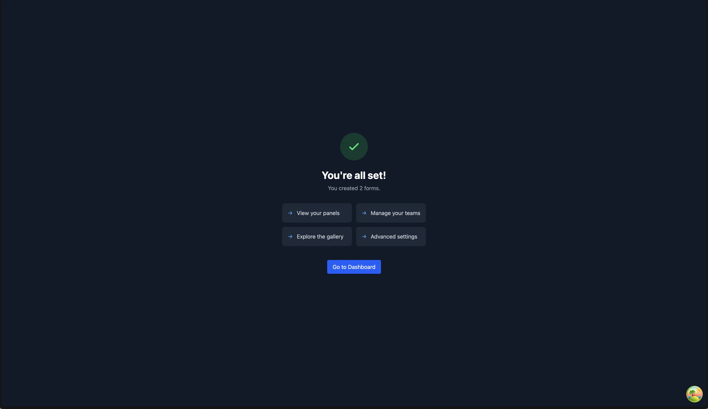

# Setup Wizard

When you first add Tickets to your server and open the web dashboard, you'll be guided through a setup wizard that walks you through configuring the essentials. The wizard covers creating support teams, building ticket forms, setting up panels, and adjusting basic settings, everything you need to get a working ticket system up and running.

::: info
The setup wizard is only shown to server administrators (permission level 2+). Support staff will not see it.
:::

## Accessing the Wizard

The wizard appears automatically the first time an administrator opens the web dashboard for a newly invited server. A blue banner at the top of the web dashboard links to the wizard.


If you dismiss or skip the wizard, you can always return to it manually by navigating to:

```text
https://dashboard.tickets.bot/manage/<your-server-id>/setup
```

## Step 1: Welcome

The welcome screen introduces the wizard and shows an overview of the steps ahead. Your server's name and icon are displayed at the top.



- **Let's get started** - begins the guided setup.
- **Skip setup** - dismisses the wizard and takes you to the settings page. You can return to the wizard later if needed.

## Step 2: Teams

Support teams determine which staff members receive and handle tickets. In this step you can create one or more teams and assign Discord roles to them.



1. Enter a **team name** (e.g. "Support", "Billing", "Moderators") and click **Create Team**.
2. Once created, use the **role selector** to assign Discord roles to the team. Members with those roles will be able to see and respond to tickets routed to this team.
3. You can create multiple teams, each can handle different types of tickets.

::: tip
You can always create more teams or adjust role assignments later from the [Staff Teams](/dashboard/staff-teams) page.
:::

If you skip this step, a default team will be used, which includes all users with the Administrator permission.

## Step 3: Forms

Forms collect information from users when they open a ticket. For example, you might ask for their issue description, order number, or preferred language before the ticket is created.



1. Enter a **form title** (e.g. "Support Request") and click **Create**.
2. Click **+ Add Field** to add questions to the form.
3. For each field, configure:
   - **Label** - the question text shown to the user.
   - **Type** - Text Input, String Select, User Select, Role Select, Mentionable Select, Channel Select, Radio Group, or Checkbox Group.
   - **Style** - for text inputs, choose between single-line or multi-line.
   - **Required** - whether the user must fill in this field.
   - **Length/Items Range** - minimum and maximum character count (for text) or selection count (for selects).
   - **Options** - for select, radio, and checkbox types, add the choices the user can pick from.

You can add up to **5 fields** per form. Forms are saved automatically when you advance to the next step.

::: info
Forms are optional. If you skip this step, users will open tickets without being asked any questions. You can always create forms later from the [Forms](/dashboard/forms) page.
:::

## Step 4: Panels

A panel is the embed message with a button that users click to open a ticket. This is the most visible part of your ticket system, it is what your members will interact with.

You have two options:

### Import a Template

The **Import a template** tab shows featured panel templates from the community gallery. These are pre-configured panels that you can import with a couple of clicks.



1. Browse the featured templates and click **Import** on one you like.
2. Select a **channel** to send the panel message to (this should be a channel all members can see).
3. Select a **category** for ticket channels to be created under.
4. Click **Import Panel**, the panel will be created and sent to your Discord server immediately.

### Create from Scratch

The **Create from scratch** tab lets you build a panel yourself:



- **Title** - the bold heading of the panel embed.
- **Content** - the description text in the embed.
- **Colour** - the accent colour on the left side of the embed.
- **Channel** - where the panel message will be sent.
- **Category** - where ticket channels will be created.
- **Team** - which support team handles tickets from this panel.
- **Form** - optionally attach a form you created in the previous step.

Click **Create Panel** to send the panel to Discord.

::: tip
You can create additional panels later from the [Ticket Panels](/dashboard/ticket-panels) page, including advanced options like welcome messages, access control lists, cooldowns, and support hours.
:::

## Step 5: Settings

The final step lets you adjust a few common settings. These are a small subset of the full settings available on the [Settings](/dashboard/settings/settings) page.



- **Language** - the language used for bot messages in Discord.
- **Success / Failure colour** - the accent colours used in bot embeds for success and error messages.
- **Users can close their own tickets** - whether ticket openers can close their own tickets.
- **Close confirmation** - whether a confirmation prompt is shown before closing a ticket.
- **Feedback enabled** - whether users are asked to rate their support experience after a ticket is closed.

Click **Finish Setup** to save your settings and complete the wizard.

## Completion

After finishing the wizard, you will see a summary of what was created (teams, forms, and panels) along with links to the most useful dashboard pages.



From here you can:

- **View your panels** - see and manage all your ticket panels.
- **Manage your teams** - adjust team members and permissions.
- **Explore the gallery** - find more panel templates to import.
- **Advanced settings** - configure auto-close, claiming, thread mode, and more.

## Resuming the Wizard

If you close the wizard partway through, your progress is saved. When you return, the wizard will pick up where you left off. Any teams, forms, or panels you created during the wizard are saved immediately, you will not lose them.

## Dismissing the Banner

The setup banner on the web dashboard can be dismissed by clicking **Dismiss**. Once dismissed, it will not appear again for that server. You can still access the wizard directly via the URL if you change your mind.
