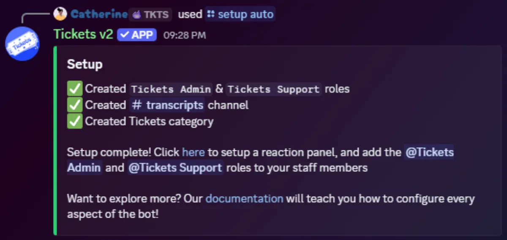

# Bot Configuration: Setup Command

Tickets provides an option to automatically create a basic configuration for you. This isn't recommended since the settings are unlikely to be to your preference, and a ticket panel is **not** automatically created. For information on creating ticket panels, see our [ticket panels guide](./ticket-panels).

To run it, first ensure that you are either the owner of the server, or the owner has designated you as an administrator of the bot using `/addadmin @YourUsername`. Next, simply execute `/setup` in a channel the bot can see.

It will update you as the process progresses:

Simply assign your support staff the new `Tickets Support` role and your administrators the `Tickets Admin` role and your staff will be able to open and support users in tickets created via `/open` or the context menu (right click > apps > start ticket.)

## What `/setup` Does

The command performs the following four actions in order:

| Step | Result |
|---|---|
| Create the `Tickets Support` role | Registered as a support role, so members holding it can see and reply to tickets |
| Create the `Tickets Admin` role | Registered as an admin role, granting full control over the bot |
| Create a `#transcripts` channel | Visible only to the two roles above; everyone else is denied access |
| Create a `Tickets` category | Where ticket channels are placed |

If any step fails (usually a missing permission), the bot marks that line with a ❌ and continues with the remaining steps.

## Settings That Moved to Panels

`/setup` is the only setup command. The options it used to accept are now configured per panel, so each panel can behave differently. Open any panel from the [Panels](/dashboard/ticket-panels) page.

For the full list of settings that moved, see [Server Settings](/dashboard/settings/settings#looking-for-a-setting-that-used-to-be-here).

You'll probably want to [create a ticket panel](./ticket-panels) so it's easier for your server members to open a ticket, or tweak the settings on the [web dashboard](./dashboard).
