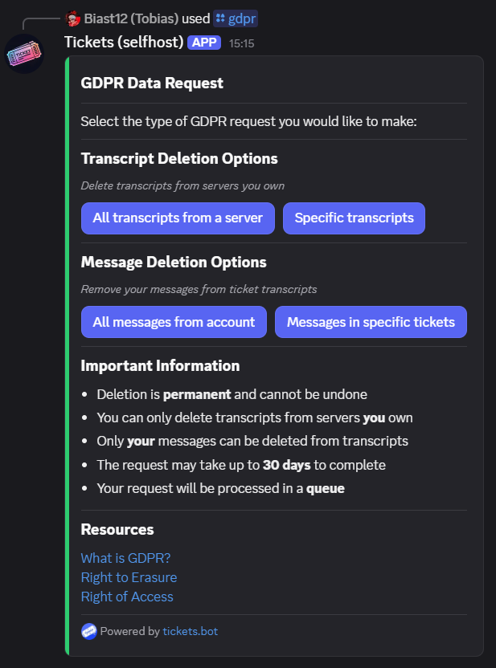
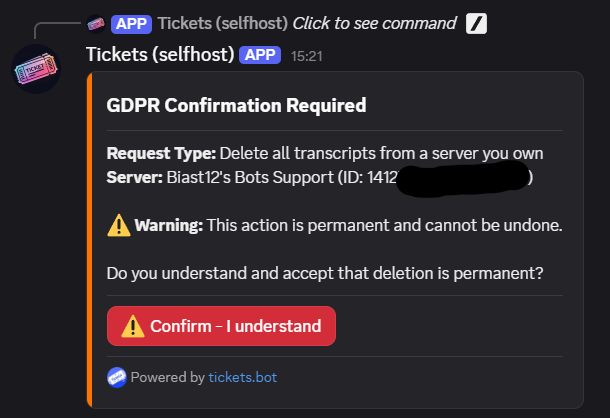
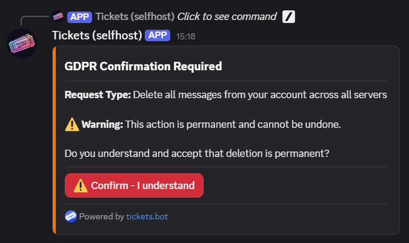
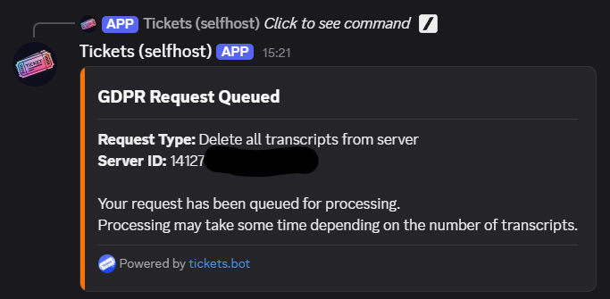
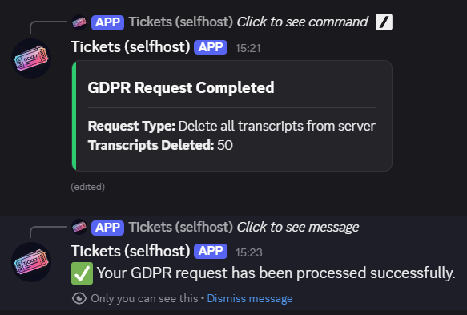

# GDPR Data Request
***

The `/gdpr` command allows users to exercise their data protection rights under the General Data Protection Regulation (GDPR). This command enables users to request deletion of ticket transcripts from servers they own, or anonymization of their messages from transcripts they participated in.

**Important:** All GDPR deletions are **permanent and cannot be undone**. Requests are processed within 30 days.

## Overview

When you run the `/gdpr` command, you'll see an interactive menu with different request types:

The command provides two main categories of requests:

### Transcript Deletion Options
*Delete transcripts from servers you own*

- **All transcripts from a server** - Deletes all ticket transcripts from one or more servers you own
- **Specific transcripts** - Deletes only specified ticket transcripts from a server you own

### Message Deletion Options
*Remove your messages from ticket transcripts*

- **All messages from account** - Anonymizes all your messages across all transcripts you participated in
- **Messages in specific tickets** - Anonymizes your messages only in specified ticket transcripts

## Language Support

The `/gdpr` command includes an optional `lang` parameter that allows you to select your preferred language for the GDPR request flow. This ensures all messages, confirmations, and completion notifications appear in your chosen language.

**Command:** `/gdpr lang:en-GB`

If no language is specified, the command defaults to English.

## Request Types

### All Transcripts from a Server

**What it does:** Permanently deletes all ticket transcripts from the selected server(s).

**Requirements:**
- You must be the **owner** of the server
- The server must have existing transcripts

**Process:**
1. Click "All transcripts from a server"
2. Select one or more servers from the dropdown menu (only servers you own with transcripts will appear)
3. Review the confirmation screen showing which servers will be affected
4. Click "Confirm - I understand" to submit the request

### Specific Transcripts from a Server

**What it does:** Permanently deletes specific ticket transcripts from a server you own.

**Requirements:**
- You must be the **owner** of the server
- The server must have existing transcripts
- You must provide valid ticket IDs

**Process:**
1. Click "Specific transcripts"
2. Select the server from the dropdown menu
3. Enter the ticket IDs you want deleted (comma-separated: e.g., `1, 2, 5, 12`)
4. Review the confirmation screen
5. Click "Confirm - I understand" to submit the request

**Ticket ID Format:**
- Comma-separated: `1, 2, 5, 12`
- One per line

### All Messages from Your Account

**What it does:** Anonymizes all your messages in every transcript you participated in across all servers.

**Requirements:**
- Must be requested from the same Discord account as the messages to be deleted

**Process:**
1. Click "All messages from account"
2. Review the confirmation screen
3. Click "Confirm - I understand" to submit the request

**What happens to your messages:**
- Your username becomes "Removed for privacy"
- Message content is replaced with "[This message was removed in accordance with data protection regulations]"
- All embeds and attachments are removed
- Your user ID is anonymized

### Messages in Specific Tickets

**What it does:** Anonymizes your messages only in specified ticket transcripts.

**Requirements:**
- You must have been a participant in the tickets
- You must provide a valid server ID
- You must provide valid ticket IDs

**Process:**
1. Click "Messages in specific tickets"
2. Enter the Server ID
3. Enter the ticket IDs (comma-separated: e.g., `1, 2, 5, 12`)
4. Review the confirmation screen
5. Click "Confirm - I understand" to submit the request

> **Tip:** To find a server ID, enable Developer Mode in Discord settings, then right-click the server icon and select "Copy Server ID". [More info](http://dis.gd/findmyid)

## Request Processing

After confirmation, your request is queued for processing:

### Processing Timeline
- Requests are queued immediately after confirmation
- Processing typically begins within a few hours
- Complete processing may take **up to 30 days** depending on the volume of data
- You'll receive a notification when processing is complete

### Completion Notification

Once your request has been processed, you'll receive two notifications:

1. **Updated Message** - The original message is updated to show completion status
2. **Ephemeral Follow-up** - An ephemeral message confirming successful processing

The completion message shows:
- **For transcript deletions:** Number of transcripts deleted
- **For message deletions:** Number of messages anonymized

## Important Information

### What Can and Cannot Be Deleted

**You CAN:**
- ✅ Delete transcripts from servers you own
- ✅ Delete your own messages from any transcript you participated in

**You CANNOT:**
- ❌ Delete transcripts from servers you don't own
- ❌ Delete other users' messages (unless you own the server and delete the entire transcript)
- ❌ Recover deleted transcripts or messages
- ❌ Undo a GDPR request once processed

### Permanence Warning

**⚠️ Warning:** All GDPR deletions are permanent and irreversible. Once data is deleted or anonymized, it cannot be recovered. Make absolutely sure you want to proceed before confirming any request.

### Request Queue
- Requests are processed in the order they are received
- You can have multiple pending requests
- Closing your DMs or leaving the support server will **not** cancel your request
- There is no way to cancel a queued request

### Processing Limits
- Message deletion requests process up to thousands of messages
- Large transcript deletions may take longer to complete
- No limit on the number of servers or tickets per request

## Frequently Asked Questions

**How long does processing take?**

Most requests are processed within a few minutes to a few hours, but GDPR regulations allow up to 30 days for completion.

**Can I cancel a request after submitting it?**

No, once a request is queued, it cannot be cancelled. Please review carefully before confirming.

**Will I be notified if my request fails?**

Yes, you'll receive a notification explaining why the request failed.

**Can I request an export of my data before deletion?**

Currently, data export is not available through the bot. Please contact support via the support server for data export requests.

**Does message deletion affect other users' ability to see the transcript?**

No, only your messages are anonymized. The transcript remains visible with your messages replaced.

**What if I accidentally request deletion of the wrong data?**

Unfortunately, there is no undo function. Deleted data cannot be recovered. Always double-check your request before confirming.

## Resources

Learn more about GDPR and your data protection rights:

- [What is GDPR?](https://gdpr.eu/what-is-gdpr/)
- [Right to Erasure](https://gdpr-info.eu/art-17-gdpr/)
- [Right of Access](https://gdpr-info.eu/art-15-gdpr/)

## Need Help?

If you have questions about GDPR requests or need assistance with data protection matters, please open a support ticket in the [Tickets Support Server](https://discord.gg/VtV3rSk).
