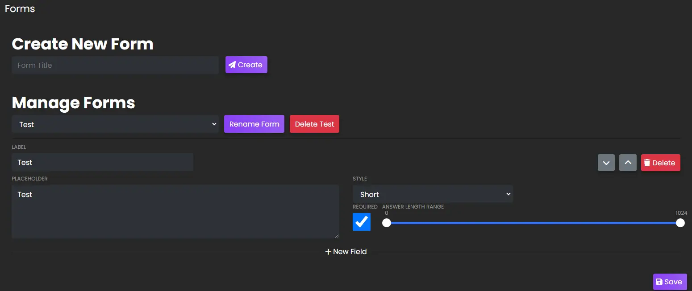
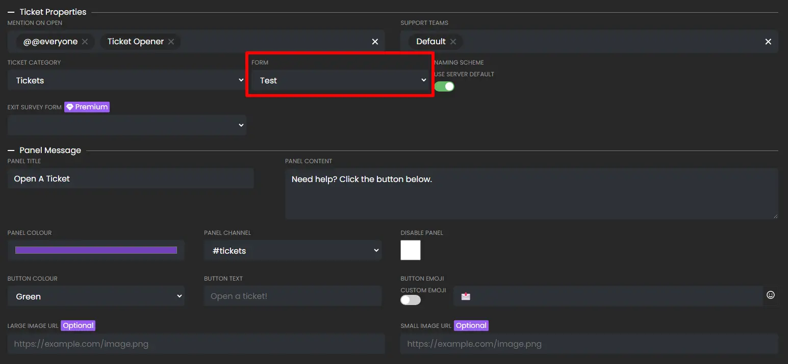

# Forms
***

Tickets has the ability to prompt users for answers to pre-defined questions when opening a ticket:

To set this up, a form must first be created and then applied to a [Ticket Panel](../dashboard/reaction-panels.md). It is possible to assign a single form to multiple different types of tickets.

## Basic Video Walkthrough
<video src="../vid/Forms.mp4" controls poster="../img/video_thumbnails/Thumbnail_Forms.webp"></video>

## Creating the Form
First, head over to the [dashboard](https://dashboard.ticketsbot.cloud) and select your server.

Then, select the `Forms` tab in the navigation bar:

You can now create your first form. Enter a name for it, and press `Create`:

Next, select your form from the `Manage Forms` dropdown list, and add up to 5 inputs. Enter a label for the question, some placeholder text, and select the type of input:

> **Note the discord imposed limitations for forms:**
> - Maximum of 5 inputs per form
> - Currently only supports text input style - no radio buttons, or checkboxes
> - Maximum character limits
>   - Name - 45
>   - Labels - 45
>   - Placeholder - 100

Make sure to save your inputs.
Your form has now been created. In order to show it to users, you must assign it to a `Ticket Panel`.

## Assign Form to a Panel
Head over to the `Ticket Panels` page of the dashboard via the top navigation bar, as shown in the [panels](../setup/panels.md) documentation.

Either create a new `Ticket Panel`, or choose an existing one to edit. You will notice a dropdown labeled `Form`. Expand this dropdown, and select your new form:

Save your changes, and then test it out!

## Multipanels
When using [multi-panels](./multipanels) (different types of tickets combined into 1 message with multiple buttons), the form shown to the user is the form associated to the panel of the button clicked.
